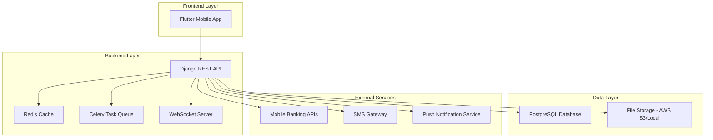

# Clean Care Bangladesh - Complete Technical Implementation Guide

## 📋 Executive Summary

This comprehensive guide provides step-by-step implementation instructions for the Clean Care Bangladesh smart city management system, integrating Django REST Framework backend with PostgreSQL database and Flutter mobile frontend.

## 🏗️ System Architecture Overview

### Complete Architecture Flow


## 🔧 Technology Stack

### Backend Technologies
- **Framework**: Django 4.2 LTS + Django REST Framework 3.14
- **Database**: PostgreSQL 15 (Primary) + Redis 7.0 (Cache)
- **Task Queue**: Celery 5.3 + Redis (Broker)
- **Real-time**: Django Channels 4.0 + WebSocket
- **Authentication**: JWT (djangorestframework-simplejwt)
- **File Storage**: AWS S3 / Local Storage
- **API Documentation**: drf-spectacular (OpenAPI 3.0)

### Frontend Technologies
- **Framework**: Flutter 3.16+ + Dart 3.0+
- **UI Framework**: Material Design 3 + Custom 3D Components
- **State Management**: Provider Pattern
- **Local Storage**: SharedPreferences + Hive
- **HTTP Client**: Dio Package
- **Animations**: Flutter AnimationController

## 📁 Project Structure

### Django Backend Structure
```
clean_care_backend/
├── manage.py
├── requirements.txt
├── .env
├── clean_care/
│   ├── settings/
│   │   ├── base.py
│   │   ├── development.py
│   │   ├── production.py
│   │   └── testing.py
│   ├── urls.py
│   ├── wsgi.py
│   ├── asgi.py
│   └── celery.py
├── apps/
│   ├── authentication/
│   ├── users/
│   ├── complaints/
│   ├── payments/
│   ├── donations/
│   ├── emergency/
│   ├── waste_management/
│   ├── gallery/
│   ├── chat/
│   ├── notices/
│   └── dashboard/
├── core/
│   ├── middleware.py
│   ├── permissions.py
│   ├── pagination.py
│   └── utils.py
└── static/
    └── media/
```

### Flutter Frontend Structure
```
lib/
├── main.dart
├── core/
│   ├── constants/
│   ├── errors/
│   ├── network/
│   └── utils/
├── data/
│   ├── models/
│   ├── repositories/
│   └── datasources/
├── presentation/
│   ├── providers/
│   ├── pages/
│   └── widgets/
└── services/
```

## 🚀 Step-by-Step Implementation Guide

### Phase 1: Backend Foundation (Week 1-2)

#### 1.1 Environment Setup
```bash
# Create project directory
mkdir clean_care_backend
cd clean_care_backend

# Create virtual environment
python -m venv venv

# Activate virtual environment
# Windows:
venv\Scripts\activate
# Linux/Mac:
source venv/bin/activate

# Install dependencies
cat > requirements.txt << EOF
Django==4.2.7
djangorestframework==3.14.0
djangorestframework-simplejwt==5.3.0
django-cors-headers==4.3.1
psycopg2-binary==2.9.7
redis==5.0.1
celery==5.3.4
channels==4.0.0
channels-redis==4.1.0
Pillow==10.1.0
django-storages==1.14.2
boto3==1.29.7
drf-spectacular==0.26.5
django-filter==23.3
python-decouple==3.8
EOF

pip install -r requirements.txt
```

#### 1.2 Django Project Initialization
```bash
# Create Django project
django-admin startproject clean_care .

# Create Django apps
python manage.py startapp authentication
python manage.py startapp users
python manage.py startapp complaints
python manage.py startapp payments
python manage.py startapp donations
python manage.py startapp emergency
python manage.py startapp waste_management
python manage.py startapp gallery
python manage.py startapp chat
python manage.py startapp notices
python manage.py startapp dashboard
```

#### 1.3 Database Configuration
```bash
# PostgreSQL setup (run in PostgreSQL)
CREATE DATABASE clean_care_db;
CREATE USER clean_care_user WITH PASSWORD 'your_password';
GRANT ALL PRIVILEGES ON DATABASE clean_care_db TO clean_care_user;
```

#### 1.4 Settings Configuration
Create `clean_care/settings/base.py`:
```python
import os
from pathlib import Path
from decouple import config
from datetime import timedelta

BASE_DIR = Path(__file__).resolve().parent.parent.parent

SECRET_KEY = config('SECRET_KEY', default='your-secret-key-here')
DEBUG = config('DEBUG', default=True, cast=bool)

ALLOWED_HOSTS = ['*']

# Application definition
DJANGO_APPS = [
    'django.contrib.admin',
    'django.contrib.auth',
    'django.contrib.contenttypes',
    'django.contrib.sessions',
    'django.contrib.messages',
    'django.contrib.staticfiles',
]

THIRD_PARTY_APPS = [
    'rest_framework',
    'rest_framework_simplejwt',
    'corsheaders',
    'channels',
    'drf_spectacular',
    'django_filters',
]

LOCAL_APPS = [
    'apps.authentication',
    'apps.users',
    'apps.complaints',
    'apps.payments',
    'apps.donations',
    'apps.emergency',
    'apps.waste_management',
    'apps.gallery',
    'apps.chat',
    'apps.notices',
    'apps.dashboard',
]

INSTALLED_APPS = DJANGO_APPS + THIRD_PARTY_APPS + LOCAL_APPS

MIDDLEWARE = [
    'corsheaders.middleware.CorsMiddleware',
    'django.middleware.security.SecurityMiddleware',
    'django.contrib.sessions.middleware.SessionMiddleware',
    'django.middleware.common.CommonMiddleware',
    'django.middleware.csrf.CsrfViewMiddleware',
    'django.contrib.auth.middleware.AuthenticationMiddleware',
    'django.contrib.messages.middleware.MessageMiddleware',
    'django.middleware.clickjacking.XFrameOptionsMiddleware',
]

ROOT_URLCONF = 'clean_care.urls'
WSGI_APPLICATION = 'clean_care.wsgi.application'
ASGI_APPLICATION = 'clean_care.asgi.application'

# Database
DATABASES = {
    'default': {
        'ENGINE': 'django.db.backends.postgresql',
        'NAME': config('DB_NAME', default='clean_care_db'),
        'USER': config('DB_USER', default='postgres'),
        'PASSWORD': config('DB_PASSWORD', default='password'),
        'HOST': config('DB_HOST', default='localhost'),
        'PORT': config('DB_PORT', default='5432'),
    }
}

# REST Framework
REST_FRAMEWORK = {
    'DEFAULT_AUTHENTICATION_CLASSES': (
        'rest_framework_simplejwt.authentication.JWTAuthentication',
    ),
    'DEFAULT_PERMISSION_CLASSES': [
        'rest_framework.permissions.IsAuthenticated',
    ],
    'DEFAULT_PAGINATION_CLASS': 'rest_framework.pagination.PageNumberPagination',
    'PAGE_SIZE': 20,
    'DEFAULT_SCHEMA_CLASS': 'drf_spectacular.openapi.AutoSchema',
}

# JWT Configuration
SIMPLE_JWT = {
    'ACCESS_TOKEN_LIFETIME': timedelta(hours=24),
    'REFRESH_TOKEN_LIFETIME': timedelta(days=7),
    'ROTATE_REFRESH_TOKENS': True,
    'BLACKLIST_AFTER_ROTATION': True,
    'UPDATE_LAST_LOGIN': True,
    'ALGORITHM': 'HS256',
    'AUTH_HEADER_TYPES': ('Bearer',),
}

# CORS
CORS_ALLOW_ALL_ORIGINS = True
CORS_ALLOWED_ORIGINS = [
    "http://localhost:3000",
    "http://127.0.0.1:3000",
    "http://localhost:8080",
    "http://127.0.0.1:8080",
]

# Custom User Model
AUTH_USER_MODEL = 'users.User'

# Channels
CHANNEL_LAYERS = {
    'default': {
        'BACKEND': 'channels_redis.core.RedisChannelLayer',
        'CONFIG': {
            "hosts": [config('REDIS_URL', default='redis://localhost:6379/0')],
        },
    },
}

# Celery
CELERY_BROKER_URL = config('REDIS_URL', default='redis://localhost:6379/0')
CELERY_RESULT_BACKEND = config('REDIS_URL', default='redis://localhost:6379/0')
CELERY_ACCEPT_CONTENT = ['json']
CELERY_TASK_SERIALIZER = 'json'
CELERY_RESULT_SERIALIZER = 'json'
CELERY_TIMEZONE = 'Asia/Dhaka'
```

### Phase 2: Database Models (Week 2-3)

#### 2.1 User Model (`apps/users/models.py`)
```python
from django.contrib.auth.models import AbstractBaseUser, PermissionsMixin, BaseUserManager
from django.db import models
from django.utils import timezone

class UserManager(BaseUserManager):
    def create_user(self, phone, name, password=None, **extra_fields):
        if not phone:
            raise ValueError('Users must have a phone number')
        
        user = self.model(
            phone=phone,
            name=name,
            **extra_fields
        )
        user.set_password(password)
        user.save(using=self._db)
        return user

    def create_superuser(self, phone, name, password=None, **extra_fields):
        extra_fields.setdefault('is_staff', True)
        extra_fields.setdefault('is_superuser', True)
        extra_fields.setdefault('user_type', 'super_admin')
        
        return self.create_user(phone, name, password, **extra_fields)

class User(AbstractBaseUser, PermissionsMixin):
    USER_TYPE_CHOICES = [
        ('citizen', 'নাগরিক'),
        ('admin', 'অ্যাডমিন'),
        ('super_admin', 'সুপার অ্যাডমিন'),
        ('service_provider', 'সেবা প্রদানকারী'),
    ]
    
    phone = models.CharField(max_length=20, unique=True)
    name = models.CharField(max_length=100)
    email = models.EmailField(blank=True, null=True)
    nid = models.CharField(max_length=20, blank=True, null=True)
    address = models.TextField(blank=True, null=True)
    ward_number = models.CharField(max_length=10, blank=True, null=True)
    user_type = models.CharField(max_length=20, choices=USER_TYPE_CHOICES, default='citizen')
    is_verified = models.BooleanField(default=False)
    is_active = models.BooleanField(default=True)
    is_staff = models.BooleanField(default=False)
    date_joined = models.DateTimeField(default=timezone.now)
    last_login = models.DateTimeField(null=True, blank=True)
    
    USERNAME_FIELD = 'phone'
    REQUIRED_FIELDS = ['name']
    
    objects = UserManager()
    
    def __str__(self):
        return f"{self.name} ({self.phone})"
```

#### 2.2 Complaint Model (`apps/complaints/models.py`)
```python
from django.db import models
from django.utils import timezone
from apps.users.models import User
import uuid

class Complaint(models.Model):
    STATUS_CHOICES = [
        ('জমা দেওয়া হয়েছে', 'জমা দেওয়া হয়েছে'),
        ('প্রক্রিয়াধীন', 'প্রক্রিয়াধীন'),
        ('সমাধান করা হয়েছে', 'সমাধান করা হয়েছে'),
        ('বন্ধ করা হয়েছে', 'বন্ধ করা হয়েছে'),
    ]
    
    PRIORITY_CHOICES = [
        ('উচ্চ', 'উচ্চ'),
        ('মধ্যম', 'মধ্যম'),
        ('নিম্ন', 'নিম্ন'),
    ]
    
    CATEGORY_CHOICES = [
        ('পরিচ্ছন্নতা', 'পরিচ্ছন্নতা'),
        ('বর্জ্য ব্যবস্থাপনা', 'বর্জ্য ব্য�স্থাপনা'),
        ('পানি সরবরাহ', 'পানি সরবরাহ'),
        ('বিদ্যুৎ', 'বিদ্যুৎ'),
        ('রাস্তা-ঘাট', 'রাস্তা-ঘাট'),
        ('অন্যান্য', 'অন্যান্য'),
    ]
    
    id = models.UUIDField(primary_key=True, default=uuid.uuid4, editable=False)
    user = models.ForeignKey(User, on_delete=models.CASCADE, related_name='complaints')
    tracking_number = models.CharField(max_length=20, unique=True, editable=False)
    title = models.CharField(max_length=200)
    description = models.TextField()
    category = models.CharField(max_length=50, choices=CATEGORY_CHOICES)
    priority = models.CharField(max_length=10, choices=PRIORITY_CHOICES, default='মধ্যম')
    status = models.CharField(max_length=50, choices=STATUS_CHOICES, default='জমা দেওয়া হয়েছে')
    location = models.CharField(max_length=200, blank=True, null=True)
    latitude = models.DecimalField(max_digits=10, decimal_places=8, blank=True, null=True)
    longitude = models.DecimalField(max_digits=11, decimal_places=8, blank=True, null=True)
    ward_number = models.CharField(max_length=10, blank=True, null=True)
    assigned_to = models.ForeignKey(User, on_delete=models.SET_NULL, null=True, blank=True, related_name='assigned_complaints')
    created_at = models.DateTimeField(default=timezone.now)
    updated_at = models.DateTimeField(auto_now=True)
    resolved_at = models.DateTimeField(null=True, blank=True)
    
    class Meta:
        ordering = ['-created_at']
        indexes = [
            models.Index(fields=['tracking_number']),
            models.Index(fields=['status']),
            models.Index(fields=['category']),
            models.Index(fields=['created_at']),
        ]
    
    def __str__(self):
        return f"{self.tracking_number} - {self.title}"

class ComplaintImage(models.Model):
    complaint = models.ForeignKey(Complaint, on_delete=models.CASCADE, related_name='images')
    image = models.ImageField(upload_to='complaints/%Y/%m/%d/')
    uploaded_at = models.DateTimeField(auto_now_add=True)
    
    def __str__(self):
        return f"Image for {self.complaint.tracking_number}"

class ComplaintUpdate(models.Model):
    complaint = models.ForeignKey(Complaint, on_delete=models.CASCADE, related_name='updates')
    old_status = models.CharField(max_length=50)
    new_status = models.CharField(max_length=50)
    comment = models.TextField()
    updated_by = models.ForeignKey(User, on_delete=models.CASCADE)
    created_at = models.DateTimeField(auto_now_add=True)
    
    def __str__(self):
        return f"Update for {self.complaint.tracking_number}"
```

### Phase 3: Authentication System (Week 3-4)

#### 3.1 OTP Model (`apps/authentication/models.py`)
```python
from django.db import models
from django.utils import timezone
from datetime import timedelta
import random
from apps.users.models import User

class OTPVerification(models.Model):
    PURPOSE_CHOICES = [
        ('registration', 'Registration'),
        ('login', 'Login'),
        ('password_reset', 'Password Reset'),
    ]
    
    phone = models.CharField(max_length=20)
    code = models.CharField(max_length=6)
    purpose = models.CharField(max_length=20, choices=PURPOSE_CHOICES)
    is_used = models.BooleanField(default=False)
    created_at = models.DateTimeField(auto_now_add=True)
    expires_at = models.DateTimeField()
    
    def save(self, *args, **kwargs):
        if not self.expires_at:
            self.expires_at = timezone.now() + timedelta(minutes=5)
        super().save(*args, **kwargs)
    
    def is_expired(self):
        return timezone.now() > self.expires_at
    
    @classmethod
    def generate_otp(cls, phone, purpose):
        code = str(random.randint(100000, 999999))
        otp = cls.objects.create(
            phone=phone,
            code=code,
            purpose=purpose
        )
        return otp
```

#### 3.2 Authentication Serializers (`apps/authentication/serializers.py`)
```python
from rest_framework import serializers
from apps.users.models import User
from apps.authentication.models import OTPVerification

class UserRegistrationSerializer(serializers.ModelSerializer):
    password = serializers.CharField(write_only=True, min_length=6)
    
    class Meta:
        model = User
        fields = ['phone', 'name', 'email', 'password', 'nid', 'address', 'ward_number']
    
    def validate_phone(self, value):
        if User.objects.filter(phone=value).exists():
            raise serializers.ValidationError("This phone number is already registered.")
        return value
    
    def create(self, validated_data):
        user = User.objects.create_user(
            phone=validated_data['phone'],
            name=validated_data['name'],
            password=validated_data['password'],
            email=validated_data.get('email', ''),
            nid=validated_data.get('nid', ''),
            address=validated_data.get('address', ''),
            ward_number=validated_data.get('ward_number', ''),
        )
        return user

class UserLoginSerializer(serializers.Serializer):
    phone = serializers.CharField()
    password = serializers.CharField()

class OTPSerializer(serializers.Serializer):
    phone = serializers.CharField()
    code = serializers.CharField(min_length=6, max_length=6)
```

#### 3.3 Authentication Views (`apps/authentication/views.py`)
```python
from rest_framework import status
from rest_framework.decorators import api_view, permission_classes
from rest_framework.permissions import AllowAny, IsAuthenticated
from rest_framework.response import Response
from rest_framework_simplejwt.tokens import RefreshToken
from django.contrib.auth import authenticate
from apps.users.models import User
from apps.authentication.models import OTPVerification
from apps.authentication.serializers import (
    UserRegistrationSerializer, 
    UserLoginSerializer, 
    OTPSerializer
)
from django.utils import timezone

@api_view(['POST'])
@permission_classes([AllowAny])
def register(request):
    serializer = UserRegistrationSerializer(data=request.data)
    if serializer.is_valid():
        user = serializer.save()
        
        # Generate OTP
        otp = OTPVerification.generate_otp(user.phone, 'registration')
        
        # Send OTP via SMS (implement SMS service)
        # send_sms(user.phone, f"Your Clean Care verification code is: {otp.code}")
        
        return Response({
            'message': 'Registration successful. Please verify your phone number.',
            'phone': user.phone,
            'otp_sent': True
        }, status=status.HTTP_201_CREATED)
    
    return Response(serializer.errors, status=status.HTTP_400_BAD_REQUEST)

@api_view(['POST'])
@permission_classes([AllowAny])
def verify_otp(request):
    serializer = OTPSerializer(data=request.data)
    if serializer.is_valid():
        phone = serializer.validated_data['phone']
        code = serializer.validated_data['code']
        
        try:
            otp = OTPVerification.objects.get(
                phone=phone, 
                code=code,
                purpose='registration',
                is_used=False
            )
            
            if otp.is_expired():
                return Response({'error': 'OTP has expired'}, status=status.HTTP_400_BAD_REQUEST)
            
            # Mark OTP as used
            otp.is_used = True
            otp.save()
            
            # Verify user
            user = User.objects.get(phone=phone)
            user.is_verified = True
            user.save()
            
            # Generate JWT tokens
            refresh = RefreshToken.for_user(user)
            
            return Response({
                'message': 'Phone number verified successfully',
                'access_token': str(refresh.access_token),
                'refresh_token': str(refresh),
                'user': {
                    'phone': user.phone,
                    'name': user.name,
                    'user_type': user.user_type
                }
            }, status=status.HTTP_200_OK)
            
        except OTPVerification.DoesNotExist:
            return Response({'error': 'Invalid OTP'}, status=status.HTTP_400_BAD_REQUEST)
    
    return Response(serializer.errors, status=status.HTTP_400_BAD_REQUEST)

@api_view(['POST'])
@permission_classes([AllowAny])
def login(request):
    serializer = UserLoginSerializer(data=request.data)
    if serializer.is_valid():
        phone = serializer.validated_data['phone']
        password = serializer.validated_data['password']
        
        user = authenticate(request, phone=phone, password=password)
        
        if user is not None:
            if not user.is_verified:
                return Response({'error': 'Phone number not verified'}, status=status.HTTP_400_BAD_REQUEST)
            
            # Update last login
            user.last_login = timezone.now()
            user.save()
            
            # Generate JWT tokens
            refresh = RefreshToken.for_user(user)
            
            return Response({
                'access_token': str(refresh.access_token),
                'refresh_token': str(refresh),
                'user': {
                    'phone': user.phone,
                    'name': user.name,
                    'user_type': user.user_type
                }
            }, status=status.HTTP_200_OK)
        else:
            return Response({'error': 'Invalid credentials'}, status=status.HTTP_400_BAD_REQUEST)
    
    return Response(serializer.errors, status=status.HTTP_400_BAD_REQUEST)

@api_view(['POST'])
@permission_classes([IsAuthenticated])
def logout(request):
    try:
        refresh_token = request.data.get('refresh_token')
        token = RefreshToken(refresh_token)
        token.blacklist()
        return Response({'message': 'Logged out successfully'}, status=status.HTTP_200_OK)
    except Exception as e:
        return Response({'error': 'Invalid token'}, status=status.HTTP_400_BAD_REQUEST)
```

### Phase 4: API Implementation (Week 4-6)

#### 4.1 Complaint API (`apps/complaints/views.py`)
```python
from rest_framework import viewsets, status
from rest_framework.decorators import action
from rest_framework.response import Response
from rest_framework.permissions import IsAuthenticated
from django_filters.rest_framework import DjangoFilterBackend
from rest_framework.filters import SearchFilter, OrderingFilter
from apps.complaints.models import Complaint, ComplaintImage, ComplaintUpdate
from apps.complaints.serializers import (
    ComplaintSerializer, 
    ComplaintImageSerializer,
    ComplaintUpdateSerializer
)
from django.utils import timezone

class ComplaintViewSet(viewsets.ModelViewSet):
    queryset = Complaint.objects.all()
    serializer_class = ComplaintSerializer
    permission_classes = [IsAuthenticated]
    filter_backends = [DjangoFilterBackend, SearchFilter, OrderingFilter]
    filterset_fields = ['status', 'category', 'priority', 'ward_number']
    search_fields = ['title', 'description']
    ordering_fields = ['created_at', 'priority', 'status']
    
    def get_queryset(self):
        user = self.request.user
        if user.user_type == 'citizen':
            return Complaint.objects.filter(user=user)
        elif user.user_type in ['admin', 'super_admin']:
            return Complaint.objects.all()
        return Complaint.objects.none()
    
    def perform_create(self, serializer):
        # Generate tracking number
        import random
        import string
        tracking_number = ''.join(random.choices(string.digits, k=10))
        
        complaint = serializer.save(
            user=self.request.user,
            tracking_number=tracking_number
        )
        
        # Handle image uploads
        images = self.request.FILES.getlist('images')
        for image in images[:5]:  # Max 5 images
            ComplaintImage.objects.create(complaint=complaint, image=image)
    
    @action(detail=True, methods=['post'])
    def update_status(self, request, pk=None):
        complaint = self.get_object()
        new_status = request.data.get('status')
        comment = request.data.get('comment', '')
        
        if new_status not in [choice[0] for choice in Complaint.STATUS_CHOICES]:
            return Response({'error': 'Invalid status'}, status=status.HTTP_400_BAD_REQUEST)
        
        old_status = complaint.status
        complaint.status = new_status
        
        if new_status == 'সমাধান করা হয়েছে':
            complaint.resolved_at = timezone.now()
        
        complaint.save()
        
        # Create update record
        ComplaintUpdate.objects.create(
            complaint=complaint,
            old_status=old_status,
            new_status=new_status,
            comment=comment,
            updated_by=request.user
        )
        
        return Response({'message': 'Status updated successfully'})
    
    @action(detail=False, methods=['get'])
    def statistics(self, request):
        user = request.user
        
        if user.user_type in ['admin', 'super_admin']:
            total_complaints = Complaint.objects.count()
            pending_complaints = Complaint.objects.filter(status='জমা দেওয়া হয়েছে').count()
            in_progress_complaints = Complaint.objects.filter(status='প্রক্রিয়াধীন').count()
            resolved_complaints = Complaint.objects.filter(status='সমাধান করা হয়েছে').count()
            
            category_stats = Complaint.objects.values('category').annotate(
                count=models.Count('id')
            )
            
            return Response({
                'total_complaints': total_complaints,
                'pending_complaints': pending_complaints,
                'in_progress_complaints': in_progress_complaints,
                'resolved_complaints': resolved_complaints,
                'category_statistics': list(category_stats)
            })
        
        return Response({'error': 'Not authorized'}, status=status.HTTP_403_FORBIDDEN)
```

#### 4.2 Payment Integration (`apps/payments/services.py`)
```python
import requests
import json
from django.conf import settings
from django.utils import timezone
from apps.payments.models import Payment

class BkashPaymentService:
    def __init__(self):
        self.base_url = "https://tokenized.pay.bka.sh/v1.2.0-beta"
        self.app_key = settings.BKASH_APP_KEY
        self.app_secret = settings.BKASH_APP_SECRET
        self.username = settings.BKASH_USERNAME
        self.password = settings.BKASH_PASSWORD
    
    def get_token(self):
        """Get access token from bKash"""
        url = f"{self.base_url}/tokenized/checkout/token/grant"
        
        payload = json.dumps({
            "app_key": self.app_key,
            "app_secret": self.app_secret
        })
        
        headers = {
            'Content-Type': 'application/json',
            'password': self.password,
            'username': self.username
        }
        
        response = requests.post(url, headers=headers, data=payload)
        
        if response.status_code == 200:
            return response.json()['id_token']
        else:
            raise Exception("Failed to get bKash token")
    
    def create_payment(self, amount, phone_number, payment_reference):
        """Create payment request"""
        token = self.get_token()
        
        url = f"{self.base_url}/tokenized/checkout/create"
        
        payload = json.dumps({
            "mode": "0011",
            "payerReference": phone_number,
            "callbackURL": f"{settings.BACKEND_URL}/api/payments/bkash/callback/",
            "amount": str(amount),
            "currency": "BDT",
            "intent": "sale",
            "merchantInvoiceNumber": payment_reference
        })
        
        headers = {
            'Content-Type': 'application/json',
            'Authorization': token,
            'X-APP-Key': self.app_key
        }
        
        response = requests.post(url, headers=headers, data=payload)
        
        if response.status_code == 200:
            return response.json()
        else:
            raise Exception("Failed to create bKash payment")
    
    def execute_payment(self, payment_id):
        """Execute payment"""
        token = self.get_token()
        
        url = f"{self.base_url}/tokenized/checkout/execute"
        
        payload = json.dumps({
            "paymentID": payment_id
        })
        
        headers = {
            'Content-Type': 'application/json',
            'Authorization': token,
            'X-APP-Key': self.app_key
        }
        
        response = requests.post(url, headers=headers, data=payload)
        
        if response.status_code == 200:
            return response.json()
        else:
            raise Exception("Failed to execute bKash payment")
```

### Phase 5: Frontend Integration (Week 6-8)

#### 5.1 API Service Setup (`lib/services/api_client.dart`)
```dart
import 'package:dio/dio.dart';
import 'package:flutter/foundation.dart';

class ApiClient {
  static final Dio _dio = Dio();
  static String baseUrl = 'http://localhost:8000/api/';
  static String? _accessToken;
  
  static void initialize() {
    _dio.options.baseUrl = baseUrl;
    _dio.options.connectTimeout = const Duration(seconds: 30);
    _dio.options.receiveTimeout = const Duration(seconds: 30);
    
    // Add interceptors
    _dio.interceptors.add(InterceptorsWrapper(
      onRequest: (options, handler) {
        // Add auth token if available
        if (_accessToken != null) {
          options.headers['Authorization'] = 'Bearer $_accessToken';
        }
        return handler.next(options);
      },
      onError: (error, handler) {
        // Handle token refresh
        if (error.response?.statusCode == 401) {
          // Refresh token logic
          refreshToken();
        }
        return handler.next(error);
      },
    ));
    
    // Add logging interceptor for debug
    if (kDebugMode) {
      _dio.interceptors.add(LogInterceptor(
        requestBody: true,
        responseBody: true,
      ));
    }
  }
  
  static Future<void> setAccessToken(String token) async {
    _accessToken = token;
  }
  
  static Future<void> refreshToken() async {
    // Implement token refresh logic
    try {
      final refreshToken = await getRefreshToken();
      final response = await _dio.post('auth/refresh/', data: {
        'refresh': refreshToken,
      });
      
      if (response.statusCode == 200) {
        _accessToken = response.data['access'];
        await saveAccessToken(_accessToken!);
      }
    } catch (e) {
      // Handle refresh failure
      await clearTokens();
      // Navigate to login
    }
  }
  
  // Auth APIs
  static Future<Response> register(Map<String, dynamic> data) async {
    return await _dio.post('auth/register/', data: data);
  }
  
  static Future<Response> login(Map<String, dynamic> data) async {
    return await _dio.post('auth/login/', data: data);
  }
  
  static Future<Response> verifyOTP(Map<String, dynamic> data) async {
    return await _dio.post('auth/verify-otp/', data: data);
  }
  
  // Complaint APIs
  static Future<Response> getComplaints() async {
    return await _dio.get('complaints/');
  }
  
  static Future<Response> createComplaint(FormData data) async {
    return await _dio.post('complaints/', data: data);
  }
  
  static Future<Response> getComplaintDetails(String id) async {
    return await _dio.get('complaints/$id/');
  }
  
  // Payment APIs
  static Future<Response> processPayment(Map<String, dynamic> data) async {
    return await _dio.post('payments/process/', data: data);
  }
  
  static Future<Response> getPaymentHistory() async {
    return await _dio.get('payments/history/');
  }
  
  // Dashboard APIs
  static Future<Response> getDashboardStats() async {
    return await _dio.get('dashboard/stats/');
  }
  
  static Future<Response> getComplaintStats() async {
    return await _dio.get('complaints/statistics/');
  }
  
  // Helper methods
  static Future<String?> getAccessToken() async {
    // Get from local storage
    return _accessToken;
  }
  
  static Future<String?> getRefreshToken() async {
    // Get from local storage
    return null;
  }
  
  static Future<void> saveAccessToken(String token) async {
    // Save to local storage
    _accessToken = token;
  }
  
  static Future<void> saveRefreshToken(String token) async {
    // Save to local storage
  }
  
  static Future<void> clearTokens() async {
    _accessToken = null;
    // Clear from local storage
  }
}
```

#### 5.2 Authentication Provider (`lib/presentation/providers/auth_provider.dart`)
```dart
import 'package:flutter/material.dart';
import 'package:shared_preferences/shared_preferences.dart';
import '../../services/api_client.dart';

class AuthProvider with ChangeNotifier {
  String? _accessToken;
  String? _refreshToken;
  Map<String, dynamic>? _user;
  bool _isLoading = false;
  String? _error;

  String? get accessToken => _accessToken;
  Map<String, dynamic>? get user => _user;
  bool get isLoading => _isLoading;
  String? get error => _error;
  bool get isAuthenticated => _accessToken != null;

  Future<void> register(String phone, String name, String password, 
                       {String? email, String? nid, String? address}) async {
    _setLoading(true);
    _setError(null);

    try {
      final response = await ApiClient.register({
        'phone': phone,
        'name': name,
        'password': password,
        'email': email,
        'nid': nid,
        'address': address,
      });

      if (response.statusCode == 201) {
        // Registration successful, now verify OTP
        notifyListeners();
      } else {
        _setError('Registration failed: ${response.data['message']}');
      }
    } catch (e) {
      _setError('Registration error: $e');
    } finally {
      _setLoading(false);
    }
  }

  Future<bool> verifyOTP(String phone, String code) async {
    _setLoading(true);
    _setError(null);

    try {
      final response = await ApiClient.verifyOTP({
        'phone': phone,
        'code': code,
      });

      if (response.statusCode == 200) {
        // Store tokens
        _accessToken = response.data['access_token'];
        _refreshToken = response.data['refresh_token'];
        _user = response.data['user'];
        
        // Save to local storage
        await _saveTokens();
        
        notifyListeners();
        return true;
      } else {
        _setError('OTP verification failed');
        return false;
      }
    } catch (e) {
      _setError('OTP verification error: $e');
      return false;
    } finally {
      _setLoading(false);
    }
  }

  Future<bool> login(String phone, String password) async {
    _setLoading(true);
    _setError(null);

    try {
      final response = await ApiClient.login({
        'phone': phone,
        'password': password,
      });

      if (response.statusCode == 200) {
        // Store tokens
        _accessToken = response.data['access_token'];
        _refreshToken = response.data['refresh_token'];
        _user = response.data['user'];
        
        // Save to local storage
        await _saveTokens();
        await ApiClient.setAccessToken(_accessToken!);
        
        notifyListeners();
        return true;
      } else {
        _setError('Login failed: ${response.data['error']}');
        return false;
      }
    } catch (e) {
      _setError('Login error: $e');
      return false;
    } finally {
      _setLoading(false);
    }
  }

  Future<void> logout() async {
    try {
      await ApiClient.logout();
    } catch (e) {
      // Even if logout fails, clear local data
    } finally {
      _accessToken = null;
      _refreshToken = null;
      _user = null;
      await _clearTokens();
      notifyListeners();
    }
  }

  Future<void> loadStoredAuth() async {
    final prefs = await SharedPreferences.getInstance();
    _accessToken = prefs.getString('access_token');
    _refreshToken = prefs.getString('refresh_token');
    
    if (_accessToken != null) {
      await ApiClient.setAccessToken(_accessToken!);
    }
    
    notifyListeners();
  }

  Future<void> _saveTokens() async {
    final prefs = await SharedPreferences.getInstance();
    if (_accessToken != null) {
      await prefs.setString('access_token', _accessToken!);
    }
    if (_refreshToken != null) {
      await prefs.setString('refresh_token', _refreshToken!);
    }
  }

  Future<void> _clearTokens() async {
    final prefs = await SharedPreferences.getInstance();
    await prefs.remove('access_token');
    await prefs.remove('refresh_token');
  }

  void _setLoading(bool loading) {
    _isLoading = loading;
    notifyListeners();
  }

  void _setError(String? error) {
    _error = error;
    notifyListeners();
  }
}
```

## 📊 Database Schema

### Complete PostgreSQL Schema
```sql
-- Users table
CREATE TABLE users_user (
    id UUID PRIMARY KEY DEFAULT gen_random_uuid(),
    phone VARCHAR(20) UNIQUE NOT NULL,
    name VARCHAR(100) NOT NULL,
    email VARCHAR(254),
    nid VARCHAR(20),
    address TEXT,
    ward_number VARCHAR(10),
    user_type VARCHAR(20) DEFAULT 'citizen',
    is_verified BOOLEAN DEFAULT FALSE,
    is_active BOOLEAN DEFAULT TRUE,
    is_staff BOOLEAN DEFAULT FALSE,
    date_joined TIMESTAMP WITH TIME ZONE DEFAULT NOW(),
    last_login TIMESTAMP WITH TIME ZONE,
    password VARCHAR(128) NOT NULL
);

-- OTP Verification table
CREATE TABLE authentication_otpverification (
    id BIGSERIAL PRIMARY KEY,
    phone VARCHAR(20) NOT NULL,
    code VARCHAR(6) NOT NULL,
    purpose VARCHAR(20) NOT NULL,
    is_used BOOLEAN DEFAULT FALSE,
    created_at TIMESTAMP WITH TIME ZONE DEFAULT NOW(),
    expires_at TIMESTAMP WITH TIME ZONE NOT NULL
);

-- Complaints table
CREATE TABLE complaints_complaint (
    id UUID PRIMARY KEY DEFAULT gen_random_uuid(),
    user_id UUID REFERENCES users_user(id) ON DELETE CASCADE,
    tracking_number VARCHAR(20) UNIQUE NOT NULL,
    title VARCHAR(200) NOT NULL,
    description TEXT NOT NULL,
    category VARCHAR(50) NOT NULL,
    priority VARCHAR(10) DEFAULT 'মধ্যম',
    status VARCHAR(50) DEFAULT 'জমা দেওয়া হয়েছে',
    location VARCHAR(200),
    latitude DECIMAL(10, 8),
    longitude DECIMAL(11, 8),
    ward_number VARCHAR(10),
    assigned_to_id UUID REFERENCES users_user(id) ON DELETE SET NULL,
    created_at TIMESTAMP WITH TIME ZONE DEFAULT NOW(),
    updated_at TIMESTAMP WITH TIME ZONE DEFAULT NOW(),
    resolved_at TIMESTAMP WITH TIME ZONE
);

-- Complaint images table
CREATE TABLE complaints_complaintimage (
    id BIGSERIAL PRIMARY KEY,
    complaint_id UUID REFERENCES complaints_complaint(id) ON DELETE CASCADE,
    image VARCHAR(100) NOT NULL,
    uploaded_at TIMESTAMP WITH TIME ZONE DEFAULT NOW()
);

-- Complaint updates table
CREATE TABLE complaints_complaintupdate (
    id BIGSERIAL PRIMARY KEY,
    complaint_id UUID REFERENCES complaints_complaint(id) ON DELETE CASCADE,
    old_status VARCHAR(50) NOT NULL,
    new_status VARCHAR(50) NOT NULL,
    comment TEXT NOT NULL,
    updated_by_id UUID REFERENCES users_user(id) ON DELETE CASCADE,
    created_at TIMESTAMP WITH TIME ZONE DEFAULT NOW()
);

-- Payments table
CREATE TABLE payments_payment (
    id UUID PRIMARY KEY DEFAULT gen_random_uuid(),
    user_id UUID REFERENCES users_user(id) ON DELETE CASCADE,
    service_type VARCHAR(50) NOT NULL,
    amount DECIMAL(10, 2) NOT NULL,
    payment_method VARCHAR(20) NOT NULL,
    transaction_id VARCHAR(100),
    status VARCHAR(20) DEFAULT 'pending',
    gateway_response JSONB,
    created_at TIMESTAMP WITH TIME ZONE DEFAULT NOW(),
    updated_at TIMESTAMP WITH TIME ZONE DEFAULT NOW()
);

-- Create indexes for performance
CREATE INDEX idx_users_phone ON users_user(phone);
CREATE INDEX idx_complaints_tracking ON complaints_complaint(tracking_number);
CREATE INDEX idx_complaints_status ON complaints_complaint(status);
CREATE INDEX idx_complaints_category ON complaints_complaint(category);
CREATE INDEX idx_complaints_created ON complaints_complaint(created_at);
CREATE INDEX idx_payments_user ON payments_payment(user_id);
CREATE INDEX idx_payments_status ON payments_payment(status);
CREATE INDEX idx_otp_phone ON authentication_otpverification(phone);
CREATE INDEX idx_otp_code ON authentication_otpverification(code);

-- Create updated_at trigger
CREATE OR REPLACE FUNCTION update_updated_at_column()
RETURNS TRIGGER AS $$
BEGIN
    NEW.updated_at = NOW();
    RETURN NEW;
END;
$$ language 'plpgsql';

CREATE TRIGGER update_complaints_updated_at 
    BEFORE UPDATE ON complaints_complaint 
    FOR EACH ROW EXECUTE FUNCTION update_updated_at_column();

CREATE TRIGGER update_payments_updated_at 
    BEFORE UPDATE ON payments_payment 
    FOR EACH ROW EXECUTE FUNCTION update_updated_at_column();
```

## 🔐 Security Implementation

### Rate Limiting
```python
# In settings.py
INSTALLED_APPS += ['django_ratelimit']

# Rate limiting configuration
RATELIMIT_ENABLE = True
RATELIMIT_USE_CACHE = 'default'
RATELIMIT_FAIL_OPEN = False

# In views
from django_ratelimit.decorators import ratelimit

@ratelimit(key='user_or_ip', rate='5/m', method='POST')
@api_view(['POST'])
def login(request):
    # Login logic
    pass
```

### Input Validation
```python
# Validation utilities
import re
from django.core.exceptions import ValidationError

def validate_phone(phone):
    pattern = r'^\+8801[3-9]\d{8}$'
    if not re.match(pattern, phone):
        raise ValidationError('Invalid Bangladesh phone number format')
    return phone

def validate_nid(nid):
    if len(nid) not in [10, 13, 17]:
        raise ValidationError('NID must be 10, 13, or 17 digits')
    if not nid.isdigit():
        raise ValidationError('NID must contain only digits')
    return nid
```

## 🚀 Deployment Guide

### Production Setup
```bash
# Environment variables (.env)
DEBUG=False
SECRET_KEY=your-production-secret-key
DB_NAME=cleancare_prod
DB_USER=cleancare_user
DB_PASSWORD=strong-password
DB_HOST=localhost
DB_PORT=5432
REDIS_URL=redis://localhost:6379/0
BACKEND_URL=https://api.cleancare.gov.bd

# Gunicorn setup
pip install gunicorn

# Create systemd service
sudo nano /etc/systemd/system/cleancare.service
```

### Systemd Service Configuration
```ini
[Unit]
Description=Clean Care Django Application
After=network.target

[Service]
User=cleancare
Group=www-data
WorkingDirectory=/home/cleancare/clean_care_backend
Environment=PATH=/home/cleancare/clean_care_backend/venv/bin
ExecStart=/home/cleancare/clean_care_backend/venv/bin/gunicorn --workers 3 --bind unix:/home/cleancare/clean_care_backend/cleancare.sock clean_care.wsgi:application
Restart=always

[Install]
WantedBy=multi-user.target
```

### Nginx Configuration
```nginx
server {
    listen 80;
    server_name api.cleancare.gov.bd;

    location / {
        include proxy_params;
        proxy_pass http://unix:/home/cleancare/clean_care_backend/cleancare.sock;
    }

    location /static/ {
        alias /home/cleancare/clean_care_backend/static/;
    }

    location /media/ {
        alias /home/cleancare/clean_care_backend/media/;
    }
}
```

## 📈 Performance Optimization

### Database Optimization
```sql
-- Add indexes for common queries
CREATE INDEX CONCURRENTLY idx_complaints_user_status 
ON complaints_complaint(user_id, status) 
WHERE status IN ('জমা দেওয়া হয়েছে', 'প্রক্রিয়াধীন');

-- Partition large tables
CREATE TABLE complaints_complaint_2024 PARTITION OF complaints_complaint
FOR VALUES FROM ('2024-01-01') TO ('2025-01-01');

-- Analyze tables regularly
ANALYZE complaints_complaint;
```

### Caching Strategy
```python
# Redis caching
from django.core.cache import cache
from django.views.decorators.cache import cache_page

@cache_page(60 * 15)  # 15 minutes
def dashboard_stats(request):
    # Cache dashboard statistics
    pass

# Manual caching
def get_complaint_statistics():
    cache_key = 'complaint_stats'
    stats = cache.get(cache_key)
    
    if stats is None:
        stats = calculate_complaint_statistics()
        cache.set(cache_key, stats, 300)  # 5 minutes
    
    return stats
```

## 🔍 Monitoring & Logging

### Logging Configuration
```python
# In settings.py
LOGGING = {
    'version': 1,
    'disable_existing_loggers': False,
    'formatters': {
        'verbose': {
            'format': '{levelname} {asctime} {module} {process:d} {thread:d} {message}',
            'style': '{',
        },
    },
    'handlers': {
        'file': {
            'level': 'INFO',
            'class': 'logging.FileHandler',
            'filename': '/var/log/cleancare/cleancare.log',
            'formatter': 'verbose',
        },
        'console': {
            'level': 'DEBUG',
            'class': 'logging.StreamHandler',
            'formatter': 'verbose',
        },
    },
    'root': {
        'handlers': ['file', 'console'],
        'level': 'INFO',
    },
}
```

### Health Check Endpoint
```python
# In apps/core/views.py
from django.db import connection
from django.core.cache import cache
from rest_framework.decorators import api_view
from rest_framework.response import Response

@api_view(['GET'])
def health_check(request):
    """System health check endpoint"""
    health_status = {
        'status': 'healthy',
        'timestamp': timezone.now().isoformat(),
        'services': {}
    }
    
    # Check database
    try:
        with connection.cursor() as cursor:
            cursor.execute("SELECT 1")
            cursor.fetchone()
        health_status['services']['database'] = 'healthy'
    except Exception as e:
        health_status['services']['database'] = f'unhealthy: {str(e)}'
        health_status['status'] = 'unhealthy'
    
    # Check Redis
    try:
        cache.set('health_check', 'test', 30)
        cache.get('health_check')
        health_status['services']['redis'] = 'healthy'
    except Exception as e:
        health_status['services']['redis'] = f'unhealthy: {str(e)}'
        health_status['status'] = 'unhealthy'
    
    return Response(health_status)
```

## 📱 Flutter Integration Checklist

### Core Features Implementation
- [ ] Authentication flow (Login/Register/OTP)
- [ ] Complaint submission with image upload
- [ ] Payment gateway integration
- [ ] Real-time chat system
- [ ] Push notifications
- [ ] Offline support with Hive
- [ ] Bengali language support
- [ ] 3D UI components
- [ ] Bottom navigation
- [ ] Profile management

### API Integration Points
- [ ] User registration endpoint
- [ ] OTP verification endpoint
- [ ] Complaint CRUD operations
- [ ] Payment processing
- [ ] Dashboard statistics
- [ ] File upload handling
- [ ] WebSocket connection
- [ ] Token refresh mechanism

### Performance Optimizations
- [ ] Image compression before upload
- [ ] Pagination for lists
- [ ] Lazy loading
- [ ] Cache implementation
- [ ] Background sync
- [ ] Error handling
- [ ] Retry mechanisms

## 🔒 Security Checklist

### Backend Security
- [ ] SQL injection prevention
- [ ] XSS protection
- [ ] CSRF tokens
- [ ] Rate limiting
- [ ] Input validation
- [ ] File upload security
- [ ] JWT token security
- [ ] CORS configuration
- [ ] HTTPS enforcement
- [ ] Database encryption

### Frontend Security
- [ ] Secure API calls
- [ ] Token storage security
- [ ] Input validation
- [ ] Certificate pinning
- [ ] Obfuscation
- [ ] Root/jailbreak detection

## 📋 Testing Strategy

### Backend Testing
```python
# Unit tests
python manage.py test apps.authentication.tests
python manage.py test apps.complaints.tests
python manage.py test apps.payments.tests

# Integration tests
python manage.py test apps.integration_tests

# Performance tests
locust -f performance_tests.py
```

### Frontend Testing
```bash
# Unit tests
flutter test

# Integration tests
flutter drive --target=test_driver/app.dart

# Widget tests
flutter test test/widget/
```

## 🎯 Success Metrics

### Performance KPIs
- API response time < 500ms
- Database query time < 100ms
- 99.9% uptime
- < 1% error rate
- Concurrent user support: 1000+

### User Experience KPIs
- App load time < 3 seconds
- Image upload time < 10 seconds
- OTP delivery time < 30 seconds
- Payment processing < 60 seconds
- Complaint resolution tracking

## 📝 Deployment Checklist

### Pre-deployment
- [ ] Environment variables configured
- [ ] Database migrations run
- [ ] Static files collected
- [ ] SSL certificates installed
- [ ] Backup strategy implemented
- [ ] Monitoring alerts configured
- [ ] Load testing completed
- [ ] Security audit passed

### Post-deployment
- [ ] Health check endpoints tested
- [ ] API documentation updated
- [ ] User acceptance testing
- [ ] Performance monitoring
- [ ] Error tracking activated
- [ ] Backup verification
- [ ] Rollback plan ready

## 🚀 Next Steps

1. **Immediate Actions (Week 1)**
   - Set up development environment
   - Initialize Django project structure
   - Configure PostgreSQL database
   - Implement basic authentication

2. **Core Development (Week 2-6)**
   - Develop complaint management system
   - Integrate payment gateways
   - Build admin dashboard
   - Implement real-time chat

3. **Testing & Optimization (Week 7-8)**
   - Comprehensive testing
   - Performance optimization
   - Security hardening
   - Documentation completion

4. **Deployment & Launch (Week 9)**
   - Production deployment
   - Monitoring setup
   - User training
   - Go-live support

This comprehensive guide provides the complete roadmap for implementing the Clean Care Bangladesh smart city management system. Follow the phases sequentially and ensure thorough testing at each stage for a successful deployment.