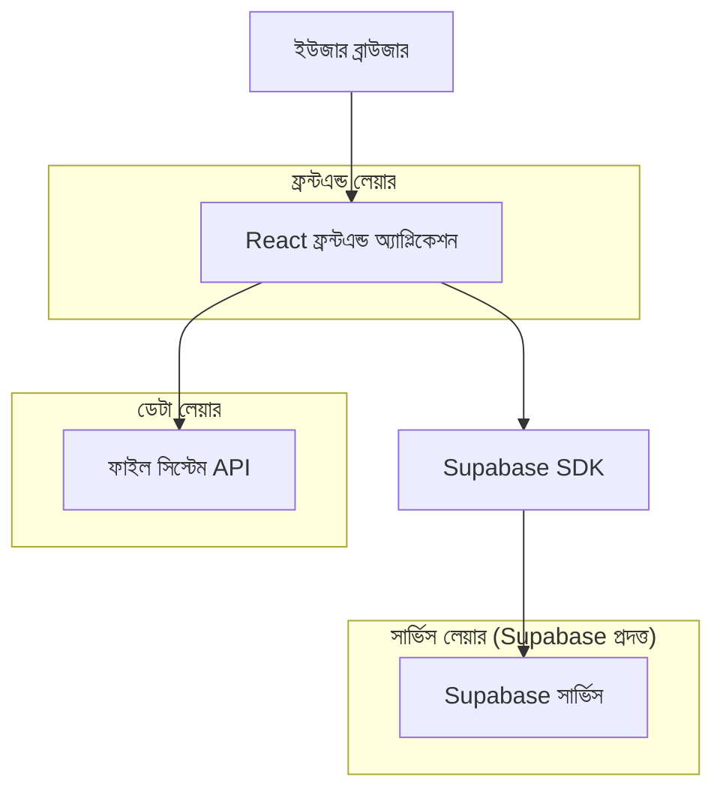
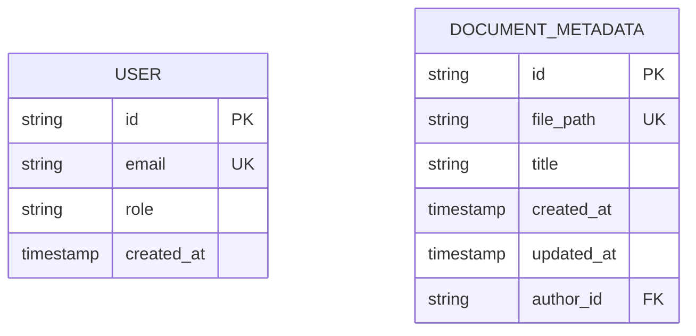

## 1. আর্কিটেকচার ডিজাইন



## 2. টেকনোলজি বিবরণ
- ফ্রন্টএন্ড: React@18 + tailwindcss@3 + vite
- ইনিশিয়ালাইজেশন টুল: vite-init
- ব্যাকএন্ড: Supabase (অথেনটিকেশন এবং ইউজার ম্যানেজমেন্টের জন্য)
- ফাইল সিস্টেম: লোকাল `/docs` ফোল্ডার

## 3. রাউট সংজ্ঞা
| রাউট | উদ্দেশ্য |
|-------|---------|
| /login | লগইন পেজ, ইউজার অথেনটিকেশন |
| /docs | ডকুমেন্ট লিস্ট পেজ, মূল নেভিগেশন |
| /docs/:path | ডকুমেন্ট প্রিভিউ পেজ, মার্কডাউন রেন্ডারিং |
| /docs/new | নতুন ডকুমেন্ট তৈরি পেজ |
| /docs/edit/:path | বিদ্যমান ডকুমেন্ট এডিট পেজ |

## 4. API সংজ্ঞা

### 4.1 কোর API

ডকুমেন্ট লিস্ট পাওয়া
```
GET /api/docs/list
```

রিকোয়েস্ট:
| প্যারাম নাম| প্যারাম টাইপ | isRequired | বিবরণ |
|-----------|-------------|-------------|-------------|
| path | string | false | ফোল্ডার পাথ |

রেসপন্স:
| প্যারাম নাম| প্যারাম টাইপ | বিবরণ |
|-----------|-------------|-------------|
| files | array | ফাইল এবং ফোল্ডার তালিকা |
| success | boolean | রেসপন্স স্ট্যাটাস |

ডকুমেন্ট কনটেন্ট পড়া
```
GET /api/docs/content
```

রিকোয়েস্ট:
| প্যারাম নাম| প্যারাম টাইপ | isRequired | বিবরণ |
|-----------|-------------|-------------|-------------|
| path | string | true | ফাইল পাথ |

রেসপন্স:
| প্যারাম নাম| প্যারাম টাইপ | বিবরণ |
|-----------|-------------|-------------|
| content | string | মার্কডাউন কনটেন্ট |
| success | boolean | রেসপন্স স্ট্যাটাস |

নতুন ডকুমেন্ট তৈরি
```
POST /api/docs/create
```

রিকোয়েস্ট:
| প্যারাম নাম| প্যারাম টাইপ | isRequired | বিবরণ |
|-----------|-------------|-------------|-------------|
| path | string | true | সংরক্ষণ পাথ |
| title | string | true | ডকুমেন্ট টাইটেল |
| content | string | true | মার্কডাউন কনটেন্ট |

রেসপন্স:
| প্যারাম নাম| প্যারাম টাইপ | বিবরণ |
|-----------|-------------|-------------|
| success | boolean | রেসপন্স স্ট্যাটাস |
| message | string | সফলতা/ব্যর্থতা বার্তা |

## 5. সার্ভার আর্কিটেকচার ডায়াগ্রাম

```mermaid
graph TD
    A[ক্লায়েন্ট / ফ্রন্টএন্ড] --> B[কন্ট্রোলার লেয়ার]
    B --> C[সার্ভিস লেয়ার]
    C --> D[ফাইল সিস্টেম লেয়ার]
    D --> E[(লোকাল ফাইল সিস্টেম)]
    
    subgraph সার্ভার
        B
        C
        D
    end
```

## 6. ডেটা মডেল

### 6.1 ডেটা মডেল সংজ্ঞা


### 6.2 ডেটা ডেফিনিশন ল্যাঙ্গুয়েজ

ইউজার টেবিল (users)
```sql
-- create table
CREATE TABLE users (
    id UUID PRIMARY KEY DEFAULT gen_random_uuid(),
    email VARCHAR(255) UNIQUE NOT NULL,
    password_hash VARCHAR(255) NOT NULL,
    role VARCHAR(20) DEFAULT 'admin' CHECK (role IN ('admin')),
    created_at TIMESTAMP WITH TIME ZONE DEFAULT NOW()
);

-- create index
CREATE INDEX idx_users_email ON users(email);
CREATE INDEX idx_users_role ON users(role);

-- init data
INSERT INTO users (email, password_hash, role) VALUES 
('admin@example.com', '$2b$10$YourHashedPasswordHere', 'admin');
```

ডকুমেন্ট মেটাডেটা টেবিল (document_metadata)
```sql
-- create table
CREATE TABLE document_metadata (
    id UUID PRIMARY KEY DEFAULT gen_random_uuid(),
    file_path VARCHAR(500) UNIQUE NOT NULL,
    title VARCHAR(255) NOT NULL,
    author_id UUID REFERENCES users(id),
    created_at TIMESTAMP WITH TIME ZONE DEFAULT NOW(),
    updated_at TIMESTAMP WITH TIME ZONE DEFAULT NOW()
);

-- create index
CREATE INDEX idx_document_metadata_path ON document_metadata(file_path);
CREATE INDEX idx_document_metadata_author ON document_metadata(author_id);
CREATE INDEX idx_document_metadata_updated ON document_metadata(updated_at DESC);
```

সাপাবেস পলিসি
```sql
-- বেসিক রিড অ্যাক্সেস অ্যানন রোলের জন্য
GRANT SELECT ON users TO anon;
GRANT SELECT ON document_metadata TO anon;

-- সম্পূর্ণ অ্যাক্সেস অথেনটিকেটেড রোলের জন্য
GRANT ALL PRIVILEGES ON users TO authenticated;
GRANT ALL PRIVILEGES ON document_metadata TO authenticated;

-- রোল ভিত্তিক অ্যাক্সেস পলিসি
CREATE POLICY "অ্যাডমিনরা সমস্ত ডকুমেন্ট দেখতে পারে" ON document_metadata
    FOR SELECT USING (auth.jwt() ->> 'role' = 'admin');

CREATE POLICY "অ্যাডমিনরা ডকুমেন্ট তৈরি করতে পারে" ON document_metadata
    FOR INSERT WITH CHECK (auth.jwt() ->> 'role' = 'admin');
```