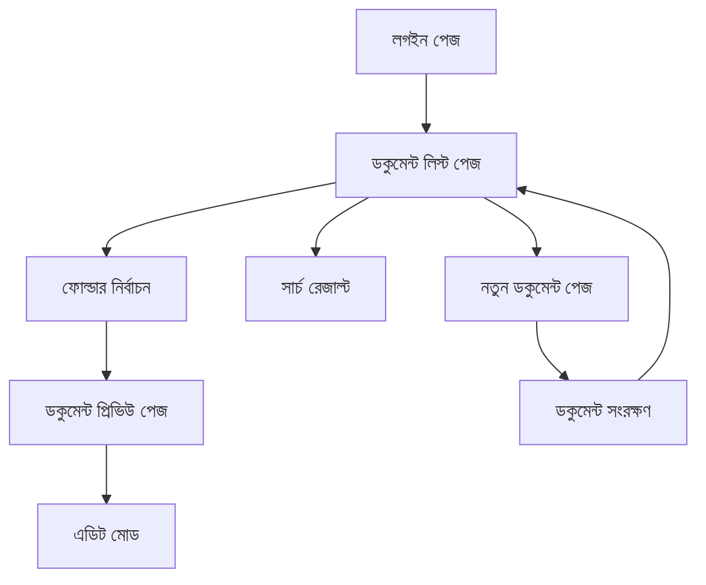

## 1. পণ্যের ওভারভিউ
অ্যাডমিন ডকুমেন্ট ভিউয়ার একটি ওয়েব অ্যাপ্লিকেশন যা অ্যাডমিনদের `/docs` ফোল্ডারে মার্কডাউন ফাইলগুলি পরিচালনা করতে সহায়তা করে। এটি দস্তাবেজ তালিকা, সার্চ, প্রিভিউ এবং নতুন ডকুমেন্ট তৈরির সুবিধা প্রদান করে।

এই পণ্যটি সমস্যা সমাধান করে: অ্যাডমিনদের জন্য একটি কেন্দ্রীয় স্থান যেখানে তারা সহজেই ডকুমেন্টেশন পরিচালনা করতে পারে।

## 2. কোর ফিচার

### 2.1 ইউজার রোল
| রোল | রেজিস্ট্রেশন পদ্ধতি | কোর পারমিশন |
|------|---------------------|------------------|
| অ্যাডমিন | ইমেইল রেজিস্ট্রেশন | সমস্ত ডকুমেন্ট দেখা, সার্চ করা, প্রিভিউ করা এবং নতুন ডকুমেন্ট তৈরি করা |

### 2.2 ফিচার মডিউল
আমাদের অ্যাডমিন ডকুমেন্ট ভিউয়ারে নিম্নলিখিত মূল পৃষ্ঠাগুলি রয়েছে:
1. **ডকুমেন্ট লিস্ট পেজ**: সাইডবারে ফোল্ডার স্ট্রাকচার, ডকুমেন্ট তালিকা, সার্চ বার।
2. **ডকুমেন্ট প্রিভিউ পেজ**: মার্কডাউন রেন্ডারিং, এডিট বাটন, নেভিগেশন।
3. **নতুন ডকুমেন্ট পেজ**: টাইটেল ইনপুট, কনটেন্ট এডিটর, সেভ বাটন।

### 2.3 পেজ বিস্তারিত
| পেজ নাম | মডিউল নাম | ফিচার বিবরণ |
|-----------|-------------|---------------------|
| ডকুমেন্ট লিস্ট পেজ | সাইডবার নেভিগেশন | `/docs` ফোল্ডারের সমস্ত সাবফোল্ডার এবং ফাইল দেখান, ট্রি স্ট্রাকচারে প্রদর্শন করুন। |
| ডকুমেন্ট লিস্ট পেজ | সার্চ ফাংশন | ফাইল নাম এবং কনটেন্ট অনুসারে সার্চ করুন, রিয়েল-টাইম রেজাল্ট দেখান। |
| ডকুমেন্ট লিস্ট পেজ | ফাইল তালিকা | নির্বাচিত ফোল্ডারের সমস্ত মার্কডাউন ফাইল দেখান, ফাইল সাইজ এবং মডিফিকেশন ডেট প্রদর্শন করুন। |
| ডকুমেন্ট প্রিভিউ পেজ | মার্কডাউন রেন্ডারার | মার্কডাউন কনটেন্টকে HTML এ রূপান্তর করুন, সিনট্যাক্স হাইলাইটিং সহ। |
| ডকুমেন্ট প্রিভিউ পেজ | এডিট অপশন | বিদ্যমান ডকুমেন্ট এডিট করার জন্য এডিট বাটন প্রদান করুন। |
| নতুন ডকুমেন্ট পেজ | ডকুমেন্ট ফর্ম | নতুন ডকুমেন্টের জন্য টাইটেল এবং কনটেন্ট ইনপুট ফিল্ড প্রদান করুন। |
| নতুন ডকুমেন্ট পেজ | ফোল্ডার সিলেকশন | নতুন ডকুমেন্ট সংরক্ষণের জন্য ফোল্ডার নির্বাচন করুন। |
| নতুন ডকুমেন্ট পেজ | সেভ ফাংশন | মার্কডাউন ফাইল হিসেবে সংরক্ষণ করুন, ফাইল নাম স্বয়ংক্রিয়ভাবে তৈরি করুন। |

## 3. কোর প্রসেস
অ্যাডমিন ফ্লো:
1. অ্যাডমিন লগইন করেন
2. ডকুমেন্ট লিস্ট পেজে পৌঁছান
3. সাইডবার থেকে ফোল্ডার নির্বাচন করেন
4. ফাইল ক্লিক করে প্রিভিউ দেখেন অথবা সার্চ বার ব্যবহার করেন
5. প্রয়োজনে নতুন ডকুমেন্ট তৈরি করেন

## 4. ইউজার ইন্টারফেস ডিজাইন

### 4.1 ডিজাইন স্টাইল
- প্রাইমারি কালার: #2563eb (ব্লু)
- সেকেন্ডারি কালার: #64748b (স্লেট)
- বাটন স্টাইল: রাউন্ডেড কর্নার, মডার্ন ফ্ল্যাট ডিজাইন
- ফন্ট: Inter, 14px বডি টেক্সট, 16px হেডিং
- লেআউট স্টাইল: সাইডবার + মেইন কনটেন্ট এরিয়া, কার্ড-বেসড ডিজাইন
- আইকন স্টাইল: Heroicons, আউটলাইন স্টাইল

### 4.2 পেজ ডিজাইন ওভারভিউ
| পেজ নাম | মডিউল নাম | UI এলিমেন্টস |
|-----------|-------------|-------------|
| ডকুমেন্ট লিস্ট পেজ | সাইডবার | 250px প্রস্থ, হালকা গ্রে ব্যাকগ্রাউন্ড, ট্রি নেভিগেশন স্টাইল |
| ডকুমেন্ট লিস্ট পেজ | মেইন কনটেন্ট | সার্চ বার উপরে, ফাইল তালিকা নিচে, গ্রিড লেআউট |
| ডকুমেন্ট প্রিভিউ পেজ | রেন্ডার এরিয়া | সাদা ব্যাকগ্রাউন্ড, ম্যাক্স-উইডথ 800px, সেন্টার অ্যালাইন |
| নতুন ডকুমেন্ট পেজ | ফর্ম এরিয়া | ইনপুট ফিল্ডস, টেক্সটএরিয়া, সেভ বাটন নিচে ডানদিকে |

### 4.3 রেসপন্সিভনেস
ডেস্কটপ-ফার্স্ট ডিজাইন, মোবাইল অ্যাডাপ্টিভ সাপোর্ট সহ। টাচ ইন্টারঅ্যাকশন অপটিমাইজেশন বিবেচনা করা হবে।