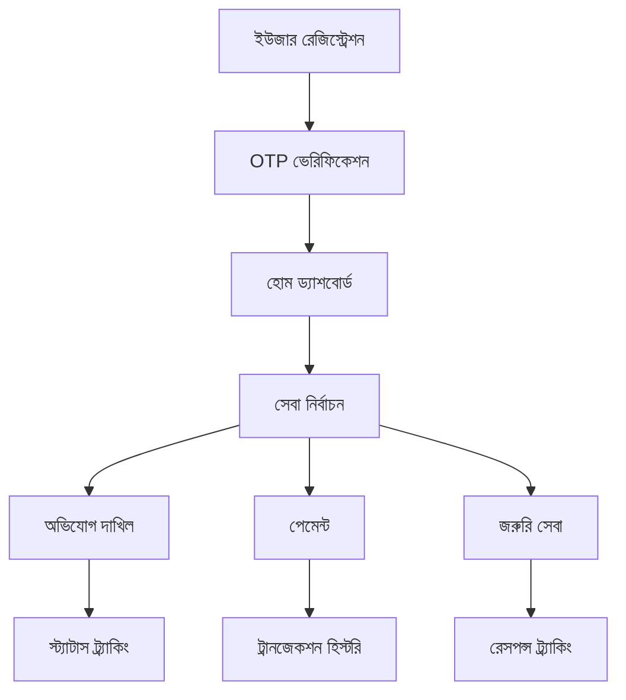

# Clean Care Django Backend - প্রোডাক্ট রিকোয়ারমেন্ট ডকুমেন্ট

## ১. প্রোডাক্ট ওভারভিউ

Clean Care একটি স্মার্ট সিটি ম্যানেজমেন্ট মোবাইল অ্যাপ্লিকেশন যা নাগরিকদের শহরের বিভিন্ন সেবা গ্রহণ এবং অভিযোগ দাখিলের সুবিধা প্রদান করে। এই অ্যাপটি Django REST Framework এবং PostgreSQL database ব্যবহার করে একটি শক্তিশালী backend সিস্টেম প্রয়োজন।

- **মূল উদ্দেশ্য**: নাগরিকদের জন্য একটি ডিজিটাল প্ল্যাটফর্ম যেখানে তারা শহরের সেবা নিতে, অভিযোগ করতে এবং পেমেন্ট করতে পারবেন।
- **টার্গেট ইউজার**: বাংলাদেশের নাগরিকরা যারা স্মার্টফোন ব্যবহার করেন এবং ডিজিটাল সেবা গ্রহণ করতে চান।
- **বাজার মূল্য**: সরকারি সেবা ডিজিটালাইজেশনের মাধ্যমে স্বচ্ছতা এবং দক্ষতা বৃদ্ধি।

## ২. কোর ফিচার

### ২.১ ইউজার রোল

| রোল | রেজিস্ট্রেশন পদ্ধতি | মূল অনুমতি |
|------|---------------------|--------------|
| সাধারণ নাগরিক | ফোন নম্বর দিয়ে রেজিস্ট্রেশন | সেবা গ্রহণ, অভিযোগ দাখিল, পেমেন্ট |
| অ্যাডমিন | সুপার অ্যাডমিন কর্তৃক তৈরি | সকল ডেটা ম্যানেজমেন্ট, রিপোর্ট দেখা |
| সেবা প্রদানকারী | অ্যাডমিন কর্তৃক অনুমোদন | নির্দিষ্ট সেবার অভিযোগ সমাধান |

### ২.২ ফিচার মডিউল

আমাদের Clean Care backend সিস্টেমে নিম্নলিখিত মূল পেজগুলি রয়েছে:

1. **Authentication System**: ফোন নম্বর ভিত্তিক লগইন/রেজিস্ট্রেশন, JWT টোকেন ম্যানেজমেন্ট
2. **Home Dashboard**: ইউজার ড্যাশবোর্ড, সেবা তালিকা, পরিসংখ্যান
3. **Complaint Management**: অভিযোগ দাখিল, ট্র্যাকিং, স্ট্যাটাস আপডেট
4. **Payment System**: মোবাইল ব্যাংকিং ইন্টিগ্রেশন (বিকাশ, নগদ, রকেট, উপায়)
5. **Donation System**: দান সংগ্রহ এবং ট্র্যাকিং
6. **Emergency Services**: জরুরি সেবা রিকোয়েস্ট এবং রেসপন্স
7. **Waste Management**: বর্জ্য ব্যবস্থাপনা সেবা
8. **Gallery Management**: ছবি আপলোড এবং প্রদর্শন
9. **Customer Care & Live Chat**: রিয়েল-টাইম চ্যাট সিস্টেম
10. **Government Calendar**: সরকারি ক্যালেন্ডার এবং ইভেন্ট
11. **Notice Board**: নোটিশ এবং ঘোষণা ম্যানেজমেন্ট
12. **Profile Management**: ইউজার প্রোফাইল সেটিংস

### ২.৩ পেজ বিস্তারিত

| পেজ নাম | মডিউল নাম | ফিচার বর্ণনা |
|---------|------------|---------------|
| Authentication | Login/Register API | ফোন নম্বর ভ্যালিডেশন, OTP ভেরিফিকেশন, JWT টোকেন জেনারেশন |
| Home Dashboard | Dashboard API | ইউজার স্ট্যাটিস্টিক্স, সেবা তালিকা, নোটিফিকেশন |
| Complaint System | Complaint CRUD API | অভিযোগ তৈরি, আপডেট, ট্র্যাকিং, ফাইল আপলোড |
| Payment Gateway | Payment Processing API | মোবাইল ব্যাংকিং API ইন্টিগ্রেশন, ট্রানজেকশন লগ |
| Donation Portal | Donation API | দান সংগ্রহ, রিপোর্ট জেনারেশন |
| Emergency Services | Emergency API | জরুরি রিকোয়েস্ট, লোকেশন ট্র্যাকিং |
| Waste Management | Waste API | বর্জ্য সংগ্রহের সময়সূচী, রিকোয়েস্ট |
| Gallery | Media API | ইমেজ আপলোড, ক্যাটাগরাইজেশন |
| Live Chat | WebSocket API | রিয়েল-টাইম মেসেজিং |
| Notice Board | Notice API | নোটিশ CRUD, পুশ নোটিফিকেশন |
| Profile Settings | User Profile API | প্রোফাইল আপডেট, পাসওয়ার্ড চেঞ্জ |

## ৩. কোর প্রসেস

### সাধারণ ইউজার ফ্লো:
1. ইউজার ফোন নম্বর দিয়ে রেজিস্ট্রেশন করে
2. OTP ভেরিফিকেশনের মাধ্যমে অ্যাকাউন্ট সক্রিয় করে
3. হোম ড্যাশবোর্ডে বিভিন্ন সেবা দেখে
4. প্রয়োজনীয় সেবা নির্বাচন করে (অভিযোগ, পেমেন্ট, ইত্যাদি)
5. সেবা সম্পন্ন করে এবং স্ট্যাটাস ট্র্যাক করে

### অ্যাডমিন ফ্লো:
1. অ্যাডমিন প্যানেলে লগইন করে
2. ইউজার রিকোয়েস্ট এবং অভিযোগ মনিটর করে
3. সেবা প্রদানকারীদের কাজ বরাদ্দ করে
4. রিপোর্ট এবং অ্যানালিটিক্স দেখে

## ৪. ইউজার ইন্টারফেস ডিজাইন

### ৪.১ ডিজাইন স্টাইল
- **প্রাইমারি কালার**: #2E8B57 (সবুজ), #3CB371 (হালকা সবুজ)
- **সেকেন্ডারি কালার**: #F6D66B (হলুদ), #E86464 (লাল)
- **বাটন স্টাইল**: 3D এলিভেটেড বাটন, রাউন্ডেড কর্নার
- **ফন্ট**: Roboto, বাংলা টেক্সটের জন্য সাপোর্ট
- **লেআউট স্টাইল**: কার্ড-বেসড ডিজাইন, টপ নেভিগেশন
- **আইকন স্টাইল**: Material Design আইকন, কাস্টম 3D ইফেক্ট

### ৪.২ পেজ ডিজাইন ওভারভিউ

| পেজ নাম | মডিউল নাম | UI এলিমেন্ট |
|---------|------------|-------------|
| Home Dashboard | Hero Section | গ্রেডিয়েন্ট ব্যাকগ্রাউন্ড, এনিমেটেড আইকন, সার্ভিস কার্ড |
| Login Page | Authentication Form | সবুজ ব্যাকগ্রাউন্ড, হোয়াইট ফর্ম কার্ড, 3D বাটন |
| Complaint Form | Form Interface | ট্যাব নেভিগেশন, ড্রপডাউন সিলেকশন, ফাইল আপলোড |
| Payment Interface | Payment Methods | পেমেন্ট মেথড কার্ড, ট্রানজেকশন হিস্টরি টেবিল |

### ৪.৩ রেসপন্সিভনেস
- **মোবাইল-ফার্স্ট**: প্রাথমিকভাবে মোবাইল ডিভাইসের জন্য অপ্টিমাইজড
- **টাচ ইন্টারঅ্যাকশন**: সব বাটন এবং ইন্টারঅ্যাক্টিভ এলিমেন্ট টাচ-ফ্রেন্ডলি
- **অ্যাডাপটিভ লেআউট**: বিভিন্ন স্ক্রিন সাইজে সামঞ্জস্যপূর্ণ