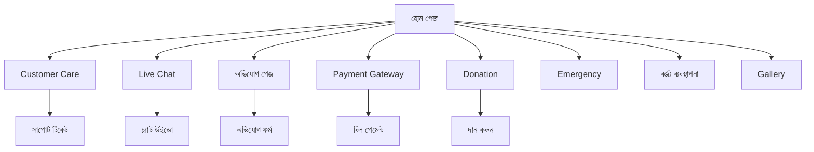

# Clean Care অ্যাপ - প্রোডাক্ট রিকোয়ারমেন্ট ডকুমেন্ট

## 1. Product Overview
Clean Care হল একটি আধুনিক সিটি সার্ভিস অ্যাপ যা ঢাকা দক্ষিণ সিটি কর্পোরেশন (DSCC) এর নাগরিকদের জন্য ডিজাইন করা হয়েছে। এটি নাগরিকদের বিভিন্ন সেবা প্রদান এবং অভিযোগ নিষ্পত্তির জন্য একটি সহজ ও কার্যকর প্ল্যাটফর্ম।

- মূল উদ্দেশ্য: নাগরিকদের সহজে সিটি সার্ভিস অ্যাক্সেস করতে সাহায্য করা এবং দ্রুত অভিযোগ সমাধানের ব্যবস্থা করা
- টার্গেট ইউজার: ঢাকা দক্ষিণ সিটি কর্পোরেশনের এলাকার সকল নাগরিক
- বাজার মূল্য: সরকারি সেবার ডিজিটাল রূপান্তর এবং নাগরিক সেবার মান উন্নয়ন

## 2. Core Features

### 2.1 User Roles
| Role | Registration Method | Core Permissions |
|------|---------------------|------------------|
| সাধারণ নাগরিক | মোবাইল নম্বর ও NID দিয়ে রেজিস্ট্রেশন | অভিযোগ দাখিল, নোটিশ দেখা, পেমেন্ট করা |
| প্রিমিয়াম ইউজার | বিশেষ সেবার জন্য আবেদন | লাইভ চ্যাট, প্রাইওরিটি সাপোর্ট |

### 2.2 Feature Module
আমাদের Clean Care অ্যাপে নিম্নলিখিত মূল পেজসমূহ রয়েছে:

1. **হোম পেজ**: 3D ফিচার ক্লাস্টার, নোটিশ বোর্ড, পরিসংখ্যান কার্ড
2. **কাস্টমার কেয়ার পেজ**: সাপোর্ট টিকেট, FAQ, যোগাযোগের তথ্য
3. **লাইভ চ্যাট পেজ**: রিয়েল-টাইম চ্যাট, ফাইল শেয়ারিং
4. **অভিযোগ পেজ**: অভিযোগ দাখিল, ট্র্যাকিং, স্ট্যাটাস আপডেট
5. **পেমেন্ট গেটওয়ে পেজ**: বিল পেমেন্ট, লেনদেনের ইতিহাস
6. **ডোনেশন পেজ**: দান করার অপশন, প্রকল্প তালিকা
7. **ইমার্জেন্সি পেজ**: জরুরি যোগাযোগ, হটলাইন নম্বর
8. **বর্জ্য ব্যবস্থাপনা পেজ**: বর্জ্য সংগ্রহের সময়সূচী, রিসাইক্লিং তথ্য
9. **গ্যালারি পেজ**: সিটি কর্পোরেশনের কার্যক্রমের ছবি ও ভিডিও

### 2.3 Page Details

| Page Name | Module Name | Feature Description |
|-----------|-------------|---------------------|
| হোম পেজ | 3D ফিচার ক্লাস্টার | ফুলের পাপড়ির মতো সাজানো 4টি মূল সেবা (Customer Care, Live Chat, Payment Gateway, Donation) এবং কেন্দ্রে অভিযোগ বাটন |
| হোম পেজ | DSCC নোটিশ বোর্ড | স্ক্রলিং নোটিশ, ওয়ার্ড ভিত্তিক তথ্য, ইভেন্ট আপডেট |
| হোম পেজ | পরিসংখ্যান কার্ড | 24/7 সক্রিয় সাপোর্ট এবং 1500+ সমাধানকৃত সমস্যার তথ্য |
| কাস্টমার কেয়ার | সাপোর্ট সিস্টেম | টিকেট তৈরি, FAQ ব্রাউজ করা, সাপোর্ট এজেন্টের সাথে যোগাযোগ |
| লাইভ চ্যাট | রিয়েল-টাইম চ্যাট | তাৎক্ষণিক বার্তা পাঠানো, ফাইল আপলোড, চ্যাট হিস্টরি |
| অভিযোগ পেজ | অভিযোগ ব্যবস্থাপনা | নতুন অভিযোগ দাখিল, ছবি আপলোড, অভিযোগের স্ট্যাটাস ট্র্যাকিং |
| পেমেন্ট গেটওয়ে | বিল পেমেন্ট | হোল্ডিং ট্যাক্স, ট্রেড লাইসেন্স ফি, অন্যান্য সরকারি ফি পরিশোধ |
| ডোনেশন | দান ব্যবস্থাপনা | বিভিন্ন প্রকল্পে দান, দানের ইতিহাস, রিসিট ডাউনলোড |
| ইমার্জেন্সি | জরুরি সেবা | ফায়ার সার্ভিস, অ্যাম্বুলেন্স, পুলিশের যোগাযোগ নম্বর |
| বর্জ্য ব্যবস্থাপনা | বর্জ্য সংগ্রহ | ওয়ার্ড ভিত্তিক বর্জ্য সংগ্রহের সময়সূচী, রিসাইক্লিং গাইড |
| গ্যালারি | মিডিয়া সংগ্রহ | সিটি কর্পোরেশনের কার্যক্রম, উন্নয়ন প্রকল্পের ছবি ও ভিডিও |

## 3. Core Process

**সাধারণ নাগরিকের ব্যবহার প্রক্রিয়া:**
1. অ্যাপ খুলে হোম পেজে প্রবেশ
2. প্রয়োজনীয় সেবা নির্বাচন (Customer Care, Live Chat, অভিযোগ, Payment, Donation)
3. সেবা ব্যবহার এবং প্রয়োজনীয় তথ্য প্রদান
4. স্ট্যাটাস ট্র্যাকিং এবং ফলাফল পর্যবেক্ষণ

**প্রিমিয়াম ইউজারের প্রক্রিয়া:**
1. লগইন করে বিশেষ সুবিধা অ্যাক্সেস
2. লাইভ চ্যাটে প্রাইওরিটি সাপোর্ট পাওয়া
3. দ্রুত অভিযোগ সমাধান এবং আপডেট

## 4. User Interface Design

### 4.1 Design Style
- **প্রাথমিক রং**: সবুজ (#2E8B57) - সরকারি সেবার প্রতীক
- **সেকেন্ডারি রং**: হলুদ (#F6D66B) - উষ্ণতা ও বন্ধুত্বের প্রতীক
- **অ্যাকসেন্ট রং**: লাল (#E86464) - জরুরি সেবার জন্য
- **বাটন স্টাইল**: 3D এলিভেটেড বাটন, গোলাকার কোণা, গ্রেডিয়েন্ট ইফেক্ট
- **ফন্ট**: Roboto (ইংরেজি), Kalpurush (বাংলা), সাইজ 14-18px
- **লেআউট স্টাইল**: কার্ড-ভিত্তিক ডিজাইন, ফ্লোটিং এলিমেন্ট
- **আইকন স্টাইল**: Material Design আইকন, সাদা রঙের আইকন

### 4.2 Page Design Overview

| Page Name | Module Name | UI Elements |
|-----------|-------------|-------------|
| হোম পেজ | 3D ফিচার ক্লাস্টার | ওভাল আকৃতির বাটন, ড্রপ শ্যাডো, গ্রেডিয়েন্ট ব্যাকগ্রাউন্ড, ফ্লোটিং ইফেক্ট |
| হোম পেজ | নোটিশ বোর্ড | সাদা কার্ড, গোলাকার কোণা, সূক্ষ্ম শ্যাডো, স্ক্রলিং টেক্সট |
| হোম পেজ | পরিসংখ্যান কার্ড | রঙিন কার্ড (সবুজ/হলুদ), বড় নম্বর, আইকন সহ |
| বটম নেভিগেশন | নেভ বার | সাদা ব্যাকগ্রাউন্ড, সবুজ অ্যাক্টিভ স্টেট, গোলাকার কেন্দ্রীয় বাটন |

### 4.3 Responsiveness
- **মোবাইল-ফার্স্ট ডিজাইন**: প্রাথমিকভাবে মোবাইল ডিভাইসের জন্য অপ্টিমাইজ করা
- **টাচ ইন্টারঅ্যাকশন**: সব বাটন ও এলিমেন্ট টাচ-ফ্রেন্ডলি (ন্যূনতম 44px)
- **অ্যাডাপটিভ লেআউট**: বিভিন্ন স্ক্রিন সাইজে সুন্দরভাবে প্রদর্শিত হয়
- **3D ইফেক্ট**: সব ডিভাইসে মসৃণ অ্যানিমেশন ও ট্রানজিশন