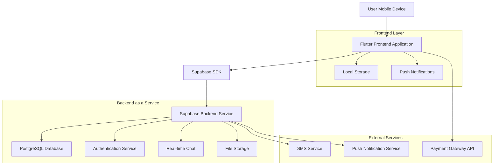
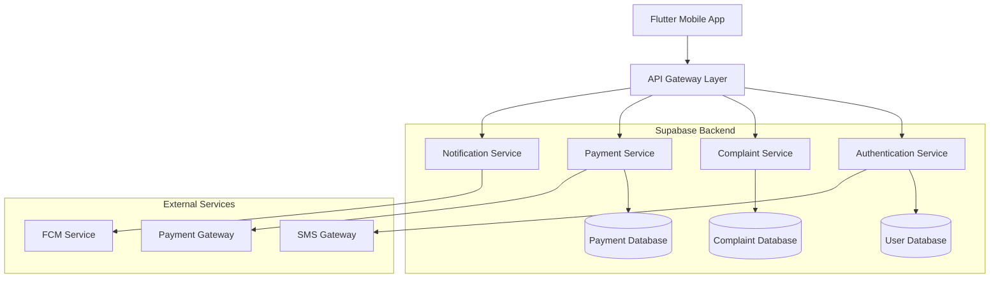
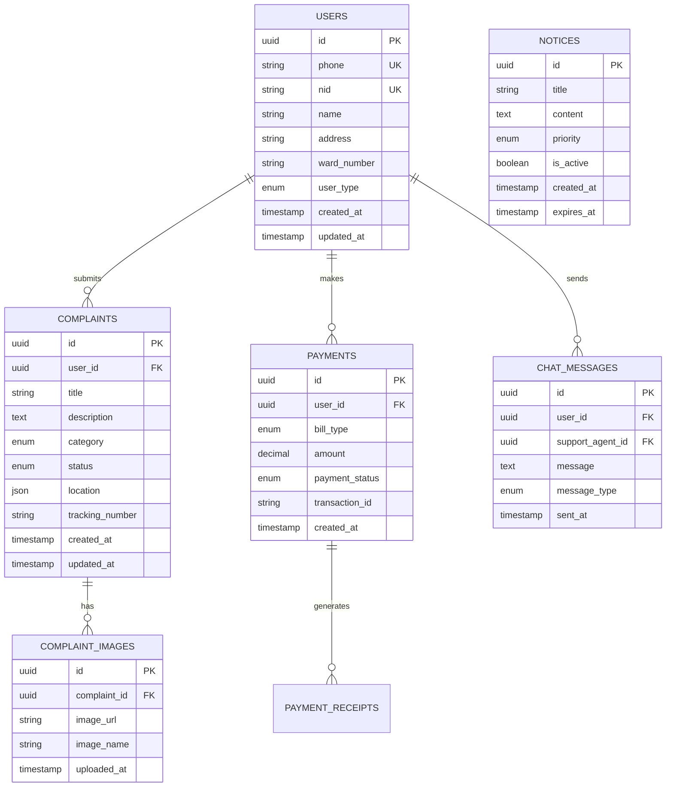

# Clean Care অ্যাপ - টেকনিক্যাল আর্কিটেকচার ডকুমেন্ট

## 1. Architecture Design



## 2. Technology Description

- **Frontend**: Flutter 3.16+ + Dart 3.0+
- **UI Framework**: Material Design 3 + Custom 3D Components
- **State Management**: Provider/Riverpod
- **Backend**: Supabase (PostgreSQL + Real-time + Auth + Storage)
- **Local Storage**: SharedPreferences + Hive
- **Animations**: Flutter AnimationController + Custom 3D Transforms
- **Networking**: Dio HTTP Client
- **Push Notifications**: Firebase Cloud Messaging (FCM)

## 3. Route Definitions

| Route | Purpose |
|-------|---------|
| /home | হোম পেজ, 3D ফিচার ক্লাস্টার এবং নোটিশ বোর্ড প্রদর্শন |
| /login | লগইন পেজ, মোবাইল নম্বর ও OTP ভেরিফিকেশন |
| /register | রেজিস্ট্রেশন পেজ, NID ও ব্যক্তিগত তথ্য সংগ্রহ |
| /customer-care | কাস্টমার কেয়ার পেজ, সাপোর্ট টিকেট ও FAQ |
| /live-chat | লাইভ চ্যাট পেজ, রিয়েল-টাইম মেসেজিং |
| /complaint | অভিযোগ পেজ, নতুন অভিযোগ দাখিল ও ট্র্যাকিং |
| /payment | পেমেন্ট গেটওয়ে, বিল পেমেন্ট ও লেনদেনের ইতিহাস |
| /donation | ডোনেশন পেজ, বিভিন্ন প্রকল্পে দান |
| /emergency | ইমার্জেন্সি পেজ, জরুরি যোগাযোগের তথ্য |
| /waste-management | বর্জ্য ব্যবস্থাপনা, সংগ্রহের সময়সূচী |
| /gallery | গ্যালারি পেজ, সিটি কর্পোরেশনের কার্যক্রমের ছবি |
| /profile | ইউজার প্রোফাইল, ব্যক্তিগত তথ্য ও সেটিংস |

## 4. API Definitions

### 4.1 Authentication APIs

**User Registration**
```
POST /auth/register
```

Request:
| Param Name | Param Type | isRequired | Description |
|------------|------------|------------|-------------|
| phone | string | true | মোবাইল নম্বর (+8801XXXXXXXXX ফরম্যাটে) |
| nid | string | true | জাতীয় পরিচয়পত্র নম্বর |
| name | string | true | পূর্ণ নাম |
| address | string | true | ঠিকানা |

Response:
| Param Name | Param Type | Description |
|------------|------------|-------------|
| success | boolean | রেজিস্ট্রেশন সফল হয়েছে কিনা |
| user_id | string | ইউজার আইডি |
| message | string | সফলতা/ব্যর্থতার বার্তা |

**User Login**
```
POST /auth/login
```

Request:
| Param Name | Param Type | isRequired | Description |
|------------|------------|------------|-------------|
| phone | string | true | মোবাইল নম্বর |
| otp | string | true | OTP কোড |

### 4.2 Complaint Management APIs

**Submit Complaint**
```
POST /api/complaints
```

Request:
| Param Name | Param Type | isRequired | Description |
|------------|------------|------------|-------------|
| title | string | true | অভিযোগের শিরোনাম |
| description | string | true | বিস্তারিত বর্ণনা |
| category | string | true | অভিযোগের ধরন |
| location | object | false | GPS কোঅর্ডিনেট |
| images | array | false | সংযুক্ত ছবিসমূহ |

Response:
| Param Name | Param Type | Description |
|------------|------------|-------------|
| complaint_id | string | অভিযোগের আইডি |
| status | string | বর্তমান স্ট্যাটাস |
| tracking_number | string | ট্র্যাকিং নম্বর |

### 4.3 Payment APIs

**Process Payment**
```
POST /api/payments
```

Request:
| Param Name | Param Type | isRequired | Description |
|------------|------------|------------|-------------|
| bill_type | string | true | বিলের ধরন (holding_tax, trade_license) |
| amount | number | true | পরিমাণ |
| payment_method | string | true | পেমেন্ট পদ্ধতি |

## 5. Server Architecture Diagram



## 6. Data Model

### 6.1 Data Model Definition



### 6.2 Data Definition Language

**Users Table**
```sql
-- Create users table
CREATE TABLE users (
    id UUID PRIMARY KEY DEFAULT gen_random_uuid(),
    phone VARCHAR(15) UNIQUE NOT NULL,
    nid VARCHAR(20) UNIQUE NOT NULL,
    name VARCHAR(100) NOT NULL,
    address TEXT NOT NULL,
    ward_number VARCHAR(10),
    user_type VARCHAR(20) DEFAULT 'citizen' CHECK (user_type IN ('citizen', 'premium', 'admin')),
    is_verified BOOLEAN DEFAULT false,
    created_at TIMESTAMP WITH TIME ZONE DEFAULT NOW(),
    updated_at TIMESTAMP WITH TIME ZONE DEFAULT NOW()
);

-- Create index
CREATE INDEX idx_users_phone ON users(phone);
CREATE INDEX idx_users_nid ON users(nid);
CREATE INDEX idx_users_ward ON users(ward_number);

-- Grant permissions
GRANT SELECT ON users TO anon;
GRANT ALL PRIVILEGES ON users TO authenticated;
```

**Complaints Table**
```sql
-- Create complaints table
CREATE TABLE complaints (
    id UUID PRIMARY KEY DEFAULT gen_random_uuid(),
    user_id UUID REFERENCES users(id) ON DELETE CASCADE,
    title VARCHAR(200) NOT NULL,
    description TEXT NOT NULL,
    category VARCHAR(50) NOT NULL CHECK (category IN ('waste_management', 'road_repair', 'water_supply', 'electricity', 'other')),
    status VARCHAR(20) DEFAULT 'submitted' CHECK (status IN ('submitted', 'in_progress', 'resolved', 'rejected')),
    location JSONB,
    tracking_number VARCHAR(20) UNIQUE NOT NULL,
    priority VARCHAR(10) DEFAULT 'medium' CHECK (priority IN ('low', 'medium', 'high', 'urgent')),
    assigned_to UUID,
    created_at TIMESTAMP WITH TIME ZONE DEFAULT NOW(),
    updated_at TIMESTAMP WITH TIME ZONE DEFAULT NOW()
);

-- Create indexes
CREATE INDEX idx_complaints_user_id ON complaints(user_id);
CREATE INDEX idx_complaints_status ON complaints(status);
CREATE INDEX idx_complaints_tracking ON complaints(tracking_number);
CREATE INDEX idx_complaints_created_at ON complaints(created_at DESC);

-- Grant permissions
GRANT SELECT ON complaints TO anon;
GRANT ALL PRIVILEGES ON complaints TO authenticated;
```

**Payments Table**
```sql
-- Create payments table
CREATE TABLE payments (
    id UUID PRIMARY KEY DEFAULT gen_random_uuid(),
    user_id UUID REFERENCES users(id) ON DELETE CASCADE,
    bill_type VARCHAR(30) NOT NULL CHECK (bill_type IN ('holding_tax', 'trade_license', 'birth_certificate', 'other')),
    amount DECIMAL(10,2) NOT NULL,
    payment_status VARCHAR(20) DEFAULT 'pending' CHECK (payment_status IN ('pending', 'completed', 'failed', 'refunded')),
    transaction_id VARCHAR(50) UNIQUE,
    payment_method VARCHAR(20) CHECK (payment_method IN ('bkash', 'nagad', 'rocket', 'card', 'bank')),
    gateway_response JSONB,
    created_at TIMESTAMP WITH TIME ZONE DEFAULT NOW(),
    updated_at TIMESTAMP WITH TIME ZONE DEFAULT NOW()
);

-- Create indexes
CREATE INDEX idx_payments_user_id ON payments(user_id);
CREATE INDEX idx_payments_status ON payments(payment_status);
CREATE INDEX idx_payments_transaction_id ON payments(transaction_id);

-- Grant permissions
GRANT SELECT ON payments TO anon;
GRANT ALL PRIVILEGES ON payments TO authenticated;
```

**Notices Table**
```sql
-- Create notices table
CREATE TABLE notices (
    id UUID PRIMARY KEY DEFAULT gen_random_uuid(),
    title VARCHAR(200) NOT NULL,
    content TEXT NOT NULL,
    priority VARCHAR(10) DEFAULT 'normal' CHECK (priority IN ('low', 'normal', 'high', 'urgent')),
    is_active BOOLEAN DEFAULT true,
    target_wards TEXT[], -- Array of ward numbers
    created_at TIMESTAMP WITH TIME ZONE DEFAULT NOW(),
    expires_at TIMESTAMP WITH TIME ZONE,
    updated_at TIMESTAMP WITH TIME ZONE DEFAULT NOW()
);

-- Create indexes
CREATE INDEX idx_notices_active ON notices(is_active);
CREATE INDEX idx_notices_priority ON notices(priority);
CREATE INDEX idx_notices_created_at ON notices(created_at DESC);

-- Grant permissions
GRANT SELECT ON notices TO anon;
GRANT ALL PRIVILEGES ON notices TO authenticated;

-- Insert initial data
INSERT INTO notices (title, content, priority, target_wards) VALUES
('বর্জ্য সংগ্রহের সময়সূচী', 'ওয়ার্ড ১২ এর বর্জ্য সংগ্রহ আগামীকাল সকাল ৬টায় নির্ধারিত', 'high', ARRAY['12']),
('নতুন রিসাইক্লিং বিন', 'ধানমন্ডি লেক এলাকায় নতুন রিসাইক্লিং বিন স্থাপন করা হয়েছে', 'normal', ARRAY['2', '3']),
('বৃক্ষরোপণ কর্মসূচী', 'এই শুক্রবার রমনা পার্কে বৃক্ষরোপণ কর্মসূচী - আমাদের সাথে যোগ দিন!', 'normal', NULL),
('Clean Dhaka Campaign', 'পরিচ্ছন্ন ঢাকা ক্যাম্পেইন চালু - আমাদের সাথে যোগ দিন!', 'high', NULL),
('প্লাস্টিক নিষেধাজ্ঞা', 'আগামী মাস থেকে প্লাস্টিক নিষেধাজ্ঞা কার্যকর', 'urgent', NULL);
```