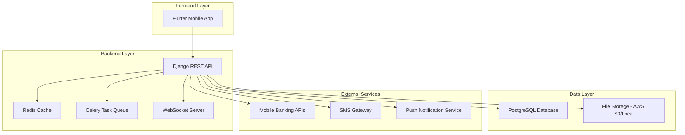
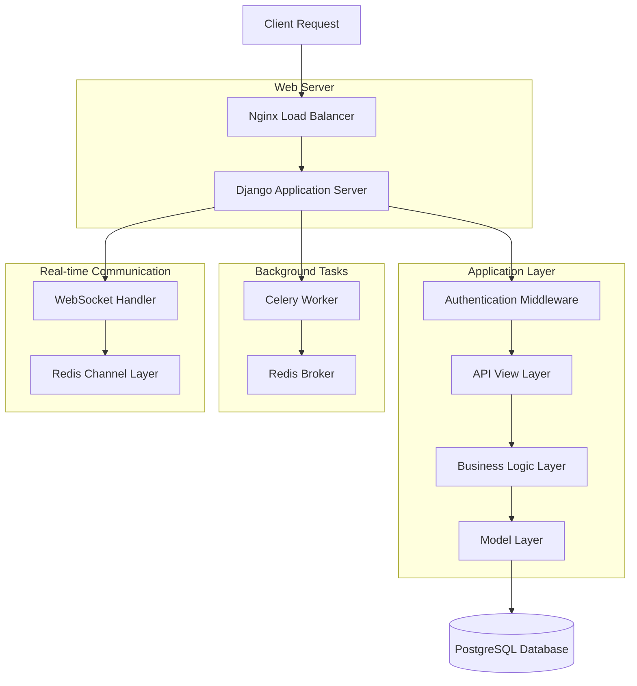
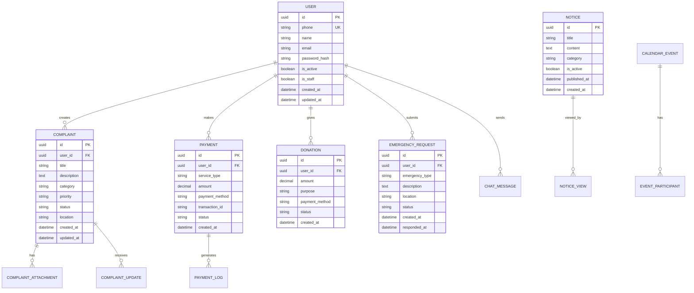

# Clean Care Django Backend - টেকনিক্যাল আর্কিটেকচার ডকুমেন্ট

## ১. আর্কিটেকচার ডিজাইন



## ২. টেকনোলজি বর্ণনা

* **Backend**: Django\@4.2 + Django REST Framework\@3.14 + Channels\@4.0

* **Database**: PostgreSQL\@15 + Redis\@7.0

* **Task Queue**: Celery\@5.3 + Redis (Broker)

* **WebSocket**: Django Channels + Redis Channel Layer

* **File Storage**: AWS S3 / Local Storage

* **Authentication**: JWT (djangorestframework-simplejwt)

* **API Documentation**: drf-spectacular (OpenAPI 3.0)

* **Monitoring**: Django Debug Toolbar + Sentry

## ৩. রুট ডেফিনিশন

| রুট              | উদ্দেশ্য                                            |
| ---------------- | --------------------------------------------------- |
| /api/auth/       | Authentication endpoints (login, register, refresh) |
| /api/users/      | User profile management                             |
| /api/complaints/ | Complaint management system                         |
| /api/payments/   | Payment processing and history                      |
| /api/donations/  | Donation management                                 |
| /api/emergency/  | Emergency service requests                          |
| /api/waste/      | Waste management services                           |
| /api/gallery/    | Media file management                               |
| /api/chat/       | Live chat system                                    |
| /api/notices/    | Notice board management                             |
| /api/calendar/   | Government calendar events                          |
| /api/dashboard/  | Dashboard statistics                                |
| /ws/chat/        | WebSocket for real-time chat                        |

## ৪. API ডেফিনিশন

### ৪.১ কোর API

#### Authentication API

```
POST /api/auth/register/
```

Request:

| Param Name | Param Type | isRequired | Description                  |
| ---------- | ---------- | ---------- | ---------------------------- |
| name       | string     | true       | ইউজারের নাম                  |
| phone      | string     | true       | ফোন নম্বর (+880 ফরম্যাটে)    |
| password   | string     | true       | পাসওয়ার্ড (কমপক্ষে ৬ অক্ষর) |
| email      | string     | false      | ইমেইল ঠিকানা                 |

Response:

| Param Name     | Param Type | Description         |
| -------------- | ---------- | ------------------- |
| access\_token  | string     | JWT অ্যাক্সেস টোকেন |
| refresh\_token | string     | JWT রিফ্রেশ টোকেন   |
| user           | object     | ইউজার তথ্য          |

Example:

```json
{
  "name": "জন ডো",
  "phone": "+8801700000000",
  "password": "123456",
  "email": "john@example.com"
}
```

#### Complaint API

```
POST /api/complaints/
```

Request:

| Param Name  | Param Type | isRequired | Description                                          |
| ----------- | ---------- | ---------- | ---------------------------------------------------- |
| title       | string     | true       | অভিযোগের শিরোনাম                                     |
| description | text       | true       | বিস্তারিত বর্ণনা                                     |
| category    | string     | true       | ক্যাটাগরি (পরিচ্ছন্নতা, বর্জ্য ব্যবস্থাপনা, ইত্যাদি) |
| priority    | string     | true       | অগ্রাধিকার (উচ্চ, মধ্যম, নিম্ন)                      |
| location    | string     | true       | অভিযোগের স্থান                                       |
| attachments | array      | false      | সংযুক্ত ফাইল                                         |

#### Payment API

```
POST /api/payments/process/
```

Request:

| Param Name      | Param Type | isRequired | Description                               |
| --------------- | ---------- | ---------- | ----------------------------------------- |
| service\_type   | string     | true       | সেবার ধরন                                 |
| amount          | decimal    | true       | পরিমাণ                                    |
| payment\_method | string     | true       | পেমেন্ট মেথড (bkash, nagad, rocket, upay) |
| phone\_number   | string     | true       | পেমেন্ট ফোন নম্বর                         |

## ৫. সার্ভার আর্কিটেকচার ডায়াগ্রাম



## ৬. ডেটা মডেল

### ৬.১ ডেটা মডেল ডেফিনিশন



### ৬.২ ডেটা ডেফিনিশন ল্যাঙ্গুয়েজ

#### User Table (users)

```sql
-- Create table
CREATE TABLE users (
    id UUID PRIMARY KEY DEFAULT gen_random_uuid(),
    phone VARCHAR(20) UNIQUE NOT NULL,
    name VARCHAR(100) NOT NULL,
    email VARCHAR(255) UNIQUE,
    password_hash VARCHAR(255) NOT NULL,
    is_active BOOLEAN DEFAULT TRUE,
    is_staff BOOLEAN DEFAULT FALSE,
    is_verified BOOLEAN DEFAULT FALSE,
    created_at TIMESTAMP WITH TIME ZONE DEFAULT NOW(),
    updated_at TIMESTAMP WITH TIME ZONE DEFAULT NOW()
);

-- Create indexes
CREATE INDEX idx_users_phone ON users(phone);
CREATE INDEX idx_users_email ON users(email);
CREATE INDEX idx_users_created_at ON users(created_at DESC);
```

#### Complaint Table (complaints)

```sql
-- Create table
CREATE TABLE complaints (
    id UUID PRIMARY KEY DEFAULT gen_random_uuid(),
    user_id UUID NOT NULL REFERENCES users(id) ON DELETE CASCADE,
    title VARCHAR(200) NOT NULL,
    description TEXT NOT NULL,
    category VARCHAR(50) NOT NULL CHECK (category IN ('পরিচ্ছন্নতা', 'বর্জ্য ব্যবস্থাপনা', 'পানি সরবরাহ', 'রাস্তাঘাট', 'বিদ্যুৎ', 'অন্যান্য')),
    priority VARCHAR(20) NOT NULL CHECK (priority IN ('উচ্চ', 'মধ্যম', 'নিম্ন')),
    status VARCHAR(30) DEFAULT 'জমা দেওয়া হয়েছে' CHECK (status IN ('জমা দেওয়া হয়েছে', 'প্রক্রিয়াধীন', 'সমাধান হয়েছে', 'বাতিল')),
    location VARCHAR(255) NOT NULL,
    created_at TIMESTAMP WITH TIME ZONE DEFAULT NOW(),
    updated_at TIMESTAMP WITH TIME ZONE DEFAULT NOW()
);

-- Create indexes
CREATE INDEX idx_complaints_user_id ON complaints(user_id);
CREATE INDEX idx_complaints_status ON complaints(status);
CREATE INDEX idx_complaints_category ON complaints(category);
CREATE INDEX idx_complaints_created_at ON complaints(created_at DESC);
```

#### Payment Table (payments)

```sql
-- Create table
CREATE TABLE payments (
    id UUID PRIMARY KEY DEFAULT gen_random_uuid(),
    user_id UUID NOT NULL REFERENCES users(id) ON DELETE CASCADE,
    service_type VARCHAR(50) NOT NULL,
    amount DECIMAL(10,2) NOT NULL,
    payment_method VARCHAR(20) NOT NULL CHECK (payment_method IN ('bkash', 'nagad', 'rocket', 'upay')),
    phone_number VARCHAR(20) NOT NULL,
    transaction_id VARCHAR(100) UNIQUE,
    status VARCHAR(20) DEFAULT 'pending' CHECK (status IN ('pending', 'completed', 'failed', 'cancelled')),
    gateway_response JSONB,
    created_at TIMESTAMP WITH TIME ZONE DEFAULT NOW(),
    updated_at TIMESTAMP WITH TIME ZONE DEFAULT NOW()
);

-- Create indexes
CREATE INDEX idx_payments_user_id ON payments(user_id);
CREATE INDEX idx_payments_status ON payments(status);
CREATE INDEX idx_payments_transaction_id ON payments(transaction_id);
CREATE INDEX idx_payments_created_at ON payments(created_at DESC);
```

#### Emergency Request Table (emergency\_requests)

```sql
-- Create table
CREATE TABLE emergency_requests (
    id UUID PRIMARY KEY DEFAULT gen_random_uuid(),
    user_id UUID NOT NULL REFERENCES users(id) ON DELETE CASCADE,
    emergency_type VARCHAR(50) NOT NULL CHECK (emergency_type IN ('অগ্নিকাণ্ড', 'চিকিৎসা জরুরি', 'পুলিশ', 'প্রাকৃতিক দুর্যোগ', 'অন্যান্য')),
    description TEXT NOT NULL,
    location VARCHAR(255) NOT NULL,
    latitude DECIMAL(10, 8),
    longitude DECIMAL(11, 8),
    status VARCHAR(30) DEFAULT 'জমা দেওয়া হয়েছে' CHECK (status IN ('জমা দেওয়া হয়েছে', 'প্রক্রিয়াধীন', 'সমাধান হয়েছে')),
    priority VARCHAR(20) DEFAULT 'উচ্চ',
    created_at TIMESTAMP WITH TIME ZONE DEFAULT NOW(),
    responded_at TIMESTAMP WITH TIME ZONE
);

-- Create indexes
CREATE INDEX idx_emergency_requests_user_id ON emergency_requests(user_id);
CREATE INDEX idx_emergency_requests_status ON emergency_requests(status);
CREATE INDEX idx_emergency_requests_created_at ON emergency_requests(created_at DESC);
```

#### Notice Table (notices)

```sql
-- Create table
CREATE TABLE notices (
    id UUID PRIMARY KEY DEFAULT gen_random_uuid(),
    title VARCHAR(200) NOT NULL,
    content TEXT NOT NULL,
    category VARCHAR(50) NOT NULL,
    is_active BOOLEAN DEFAULT TRUE,
    is_urgent BOOLEAN DEFAULT FALSE,
    published_at TIMESTAMP WITH TIME ZONE DEFAULT NOW(),
    expires_at TIMESTAMP WITH TIME ZONE,
    created_at TIMESTAMP WITH TIME ZONE DEFAULT NOW(),
    updated_at TIMESTAMP WITH TIME ZONE DEFAULT NOW()
);

-- Create indexes
CREATE INDEX idx_notices_is_active ON notices(is_active);
CREATE INDEX idx_notices_published_at ON notices(published_at DESC);
CREATE INDEX idx_notices_category ON notices(category);
```

#### Chat Message Table (chat\_messages)

```sql
-- Create table
CREATE TABLE chat_messages (
    id UUID PRIMARY KEY DEFAULT gen_random_uuid(),
    sender_id UUID NOT NULL REFERENCES users(id) ON DELETE CASCADE,
    receiver_id UUID REFERENCES users(id) ON DELETE CASCADE,
    message TEXT NOT NULL,
    message_type VARCHAR(20) DEFAULT 'text' CHECK (message_type IN ('text', 'image', 'file')),
    is_read BOOLEAN DEFAULT FALSE,
    created_at TIMESTAMP WITH TIME ZONE DEFAULT NOW()
);

-- Create indexes
CREATE INDEX idx_chat_messages_sender_id ON chat_messages(sender_id);
CREATE INDEX idx_chat_messages_receiver_id ON chat_messages(receiver_id);
CREATE INDEX idx_chat_messages_created_at ON chat_messages(created_at DESC);
```

#### Initial Data

```sql
-- Insert initial admin user
INSERT INTO users (phone, name, email, password_hash, is_staff, is_verified)
VALUES ('+8801700000001', 'System Admin', 'admin@cleancare.gov.bd', 'pbkdf2_sha256$...', TRUE, TRUE);

-- Insert sample notice categories
INSERT INTO notices (title, content, category, is_urgent)
VALUES 
('সিস্টেম রক্ষণাবেক্ষণ', 'আগামীকাল রাত ১২টা থেকে ২টা পর্যন্ত সিস্টেম রক্ষণাবেক্ষণের কাজ চলবে।', 'সিস্টেম', TRUE),
('নতুন সেবা চালু', 'অনলাইন বর্জ্য সংগ্রহের সেবা এখন উপলব্ধ।', 'সেবা', FALSE);
```

